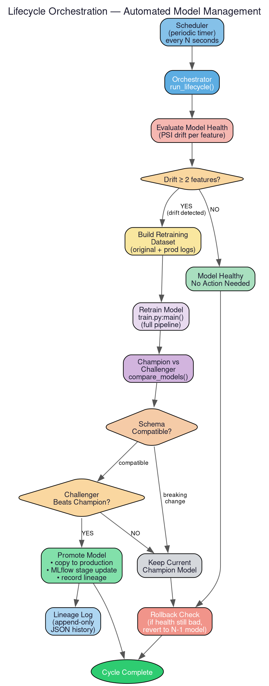

# Churn ML System

A **production-grade, end-to-end machine learning system** for predicting
customer churn in telecommunications. Built with automated model retraining,
real-time serving, data drift detection, and lifecycle management.


---

## What This Project Does

This system predicts whether a telecom customer will **churn** (leave the
service) based on their usage patterns, billing history, and account
characteristics. But it's not just a model — it's a complete production
pipeline:

1. **Trains** multiple candidate models and selects the best one automatically.
2. **Serves** predictions via a FastAPI REST API (single and batch).
3. **Monitors** the production model for data drift using Population Stability
   Index (PSI).
4. **Retrains** automatically when drift is detected.
5. **Promotes** the new model only if it outperforms the current champion and
   has a compatible feature schema.
6. **Rolls back** to the previous model if the new one degrades.
7. **Logs** every prediction durably with PII redacted.
8. **Exports** Prometheus metrics for alerting and dashboarding.

---

## Architecture

The system is organized into modular packages, each handling one concern:

| Package | Responsibility |
|---------|---------------|
| `api/` | FastAPI HTTP server with auth, rate limiting, graceful shutdown |
| `training/` | Multi-step training pipeline (ingest → validate → engineer → train → evaluate) |
| `inference/` | Offline inference engine and model contract management |
| `features/` | Shared feature builder — same code for training and serving |
| `monitoring/` | PSI-based drift detection and model health evaluation |
| `lifecycle/` | Orchestrator, model promotion, rollback, lineage tracking |
| `events/` | Durable event store (SQLAlchemy) with outbox pattern |
| `validation/` | Pandera schema enforcement from YAML definitions |
| `observability/` | Prometheus metrics (counters, histograms, gauges) |
| `config/` | YAML + environment variable configuration |
| `logging/` | Structured logging (JSON for production, text for development) |
| `utils/` | Retry with exponential backoff |

> For detailed per-file documentation, see the [`docs/`](docs/README.md) folder.

---

## Tech Stack

| Layer | Technology | Purpose |
|-------|-----------|---------|
| **ML Framework** | scikit-learn | Model training (LogisticRegression, RandomForest, GradientBoosting) |
| **Data** | Pandas, NumPy | Data manipulation and numerical computation |
| **API** | FastAPI, Uvicorn | High-performance HTTP serving |
| **Validation** | Pydantic, Pandera | Request validation (API) and data quality (training) |
| **Experiment Tracking** | MLflow | Model logging, registration, and stage management |
| **Event Store** | SQLAlchemy, SQLite | Durable prediction logging with outbox pattern |
| **Observability** | Prometheus Client | Metrics export (latency, errors, drift gauges) |
| **Rate Limiting** | SlowAPI | API abuse prevention |
| **Configuration** | PyYAML | Environment-aware YAML configuration |
| **Containerization** | Docker, Docker Compose | Reproducible deployments with resource limits |
| **Linting** | Ruff | Fast Python linting and formatting |
| **Testing** | pytest | 46 unit and integration tests |

---

## Quick Start

### Prerequisites

- Python 3.10+
- [uv](https://docs.astral.sh/uv/) (recommended) or pip

### 1. Clone and Install

```bash
git clone https://github.com/your-username/Churn_Ml_System.git
cd Churn_Ml_System
uv sync --all-extras
```

### 2. Train a Model

```bash
.venv/bin/python -m churn_system.training.train
```

This will:
- Load the raw dataset from `data/Telco_customer_churn_raw.csv`
- Validate data quality using Pandera schemas
- Train 3 candidate models (Logistic Regression, Random Forest, Gradient Boosting)
- Select the winner by PR-AUC score
- Save artifacts to `models/experiments/churn_model_YYYYMMDD_HHMMSS/`

### 3. Promote to Production

After training, promote the model to the production serving slot:

```bash
# Find the latest experiment version
ls models/experiments/

# Promote it
.venv/bin/python -c "
from churn_system.lifecycle.promote import promote_model
promote_model('churn_model_YYYYMMDD_HHMMSS')
"
```

### 4. Start the API Server

```bash
.venv/bin/python -m uvicorn churn_system.api.api:app --port 8000
```

The API is now running at `http://localhost:8000`:

- **Docs**: http://localhost:8000/docs (interactive Swagger UI)
- **Health**: http://localhost:8000/health
- **Metrics**: http://localhost:8000/metrics

### 5. Make a Prediction

```bash
curl -X POST http://localhost:8000/predict \
  -H "Content-Type: application/json" \
  -d '{
    "Country": "US",
    "State": "CA",
    "City": "Los Angeles",
    "Zip Code": "90001",
    "Lat Long": "34.0, -118.0",
    "Latitude": 34.0,
    "Longitude": -118.0,
    "Gender": "Male",
    "Senior Citizen": "No",
    "Partner": "Yes",
    "Dependents": "No",
    "Tenure Months": 12,
    "Phone Service": "Yes",
    "Multiple Lines": "No",
    "Internet Service": "Fiber Optic",
    "Online Security": "No",
    "Online Backup": "Yes",
    "Device Protection": "No",
    "Tech Support": "No",
    "Streaming TV": "Yes",
    "Streaming Movies": "Yes",
    "Contract": "Month-to-month",
    "Paperless Billing": "Yes",
    "Payment Method": "Electronic check",
    "Monthly Charges": 70.5,
    "Total Charges": 850.0
  }'
```

**Response:**
```json
{
  "request_id": "a1b2c3d4...",
  "churn_probability": 0.7312,
  "prediction": 1,
  "threshold": 0.5,
  "latency_seconds": 0.0042
}
```

---

## API Endpoints

| Endpoint | Method | Description |
|----------|--------|-------------|
| `/` | GET | Basic health check |
| `/health` | GET | Readiness/liveness probe |
| `/metrics` | GET | Prometheus metrics |
| `/predict` | POST | Single-row churn prediction |
| `/predict/batch` | POST | Batch prediction (up to 100 rows) |
| `/docs` | GET | Interactive Swagger documentation |

---

## Training Pipeline


The training pipeline runs through 5 sequential steps:

1. **Data Ingestion** — Loads raw CSV from configured path
2. **Data Validation** — Checks columns, types, and values against Pandera schemas
3. **Feature Engineering** — Drops PII/meta columns, coerces types, removes target
4. **Model Training** — Trains 3 candidates with scikit-learn pipelines
5. **Model Evaluation** — Computes 6 metrics, selects winner by configurable metric

Each run produces a versioned directory under `models/experiments/` containing
`model.pkl`, `metadata.json`, and `experiment_report.json`.

---

## Lifecycle Management



The automated lifecycle loop:

1. **Monitor** — Computes PSI drift scores for all numeric features
2. **Decide** — If ≥2 features drift past threshold (0.2), retraining triggers
3. **Retrain** — Runs the full training pipeline on combined data
4. **Compare** — Champion vs. challenger on schema compatibility + ROC-AUC
5. **Promote** — Copy winner to production, update MLflow registry, record lineage
6. **Rollback** — Safety net: revert to previous model if health degrades

---

## Monitoring & Drift Detection


The system uses **Population Stability Index (PSI)** to detect data drift:

- PSI < 0.1 → Stable
- PSI 0.1–0.2 → Moderate shift (monitor)
- PSI > 0.2 → Significant drift (action needed)

Prometheus metrics track drift counts and retraining recommendations in
real-time, with alert rules for error rates, latency spikes, and feature drift.

---

## Docker Deployment

```bash
# Start API + Prometheus
docker compose up -d

# Run training (one-shot)
docker compose run --rm train
```

The `docker-compose.yml` includes:
- CPU/memory resource limits for all services
- HTTP health check probes
- Graceful shutdown with 30s drain period
- JSON structured logging by default

---

## Configuration

All settings are in `src/churn_system/config/settings.yaml` and can be
overridden via environment variables:

```bash
# Example: change the inference threshold
export CHURN_INFERENCE_THRESHOLD=0.6

# Example: point to a PostgreSQL event store
export CHURN_EVENT_STORE_DATABASE_URL="db://<username>:<password>@localhost:5432/churn_db"

# Example: enable JSON logging
export CHURN_LOG_FORMAT=json
```

See [`docs/config.md`](docs/config.md) for the full environment variable
reference.

---

## Testing

```bash
# Run all 46 tests
.venv/bin/python -m pytest tests/ -v

# Lint check
.venv/bin/python -m ruff check src tests scripts
```

Test coverage includes:
- API endpoints (predict, batch, health, metrics, auth)
- Drift detection (PSI calculation)
- Feature engineering (column dropping, type coercion)
- Model promotion and rollback
- Schema comparison
- Lineage tracking
- Retry mechanism
- Data validation

---

## Project Structure

```
Churn_Ml_System/
├── src/churn_system/
│   ├── api/                  # FastAPI server, errors, schema generator
│   ├── config/               # settings.yaml + config loader
│   ├── events/               # SQLAlchemy event store + outbox
│   ├── features/             # Shared feature builder
│   ├── inference/            # Offline inference + model contract
│   ├── lifecycle/            # Orchestrator, promote, rollback, lineage
│   ├── logging/              # Structured logger (JSON/text)
│   ├── monitoring/           # Drift detection, health, prediction stats
│   ├── new_data/             # Retraining data builder
│   ├── observability/        # Prometheus metrics
│   ├── pipelines/            # High-level pipeline wrappers
│   ├── training/             # Training pipeline + steps
│   ├── utils/                # Retry with backoff
│   ├── validation/           # Pandera schema enforcement
│   ├── artifacts.py          # Model bundle validation
│   ├── mlflow_utils.py       # MLflow integration with retry
│   └── schema.py             # Data contracts
├── tests/                    # 46 unit/integration tests
├── data/                     # Raw data, training references
├── models/                   # Experiments, production, monitoring, lineage
├── docs/                     # Per-package documentation + diagrams
│   ├── diagrams/             # Graphviz .dot source files
│   └── images/               # Generated PNG diagrams
├── observability/            # Prometheus config + alert rules
├── docker-compose.yml        # Container orchestration
├── Dockerfile                # API container
├── Dockerfile.training       # Training container
└── pyproject.toml            # Dependencies + tool config
```

---

## Documentation

Comprehensive per-package documentation is available in the [`docs/`](docs/README.md)
folder, with colorful architecture diagrams generated from Graphviz source files.

---

## License

This project is licensed under the MIT License. See [LICENSE](LICENSE) for details.
