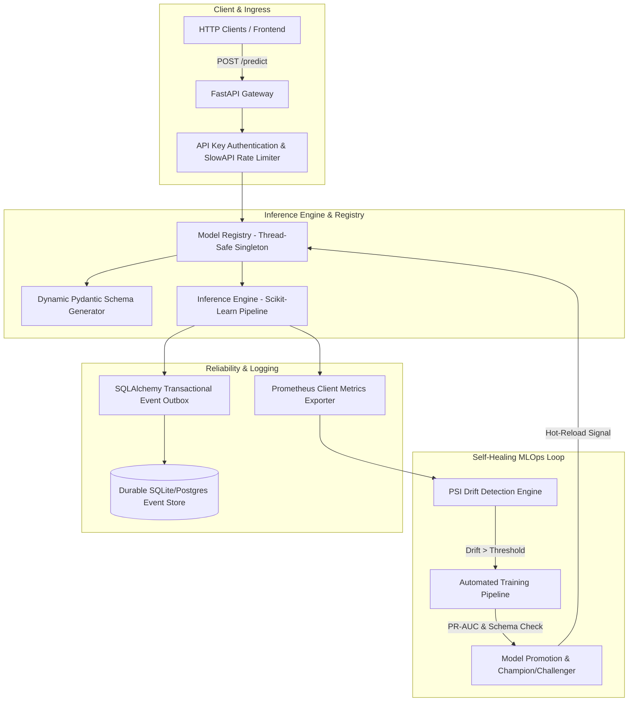

<div align="center">

# ⚡ Enterprise Churn ML System

**An end-to-end, production-grade Machine Learning & MLOps platform for automated customer churn prediction, real-time inference, data drift detection, and self-healing lifecycle management.**

[](https://www.python.org/)
[](https://fastapi.tiangolo.com/)
[](https://scikit-learn.org/)
[](https://www.docker.com/)
[](https://github.com/astral-sh/ruff)
[](https://docs.pytest.org/)
[](LICENSE)

[Architecture](#-architecture) • [Quick Start](#-quick-start) • [API Reference](#-api-reference) • [MLOps Lifecycle](#-mlops-lifecycle--drift-detection) • [Observability](#-observability--monitoring) • [Testing](#-testing--quality-assurance)

</div>

---

## 📌 Executive Summary

Predicting customer churn is not just a modeling problem — it is an operational systems challenge. Models degrade as customer behaviors shift, schema mismatches break API contracts, and unmonitored deployments fail silently.

The **Enterprise Churn ML System** bridges the gap between experimental data science and enterprise MLOps. It provides a complete, resilient microservice architecture that continuously:

1. **Ingests & Validates**: Enforces strict Pandera data quality contracts before training or inference.
2. **Trains & Ranks**: Automatically evaluates multiple model candidates (Logistic Regression, Random Forest, Gradient Boosting) using PR-AUC scoring.
3. **Serves via Async API**: Provides sub-5ms REST inference endpoints with built-in rate-limiting, authentication, and graceful shutdown.
4. **Monitors Data Drift**: Tracks Population Stability Index (PSI) per feature against baseline distributions in real-time.
5. **Triggers Self-Healing**: Automatically triggers automated retraining, candidate comparison, and safe model promotion/rollback.
6. **Ensures Reliability**: Implements a durable transactional outbox event store for asynchronous prediction logging and compliance auditing with PII redaction.

---

## 🏛️ System Architecture

The repository enforces strict separation of concerns across single-purpose domain modules:


```mermaid
flowchart TD
    subgraph ClientLayer ["Client & Ingress"]
        Client[HTTP Clients / Frontend] -->|POST /predict| Gateway[FastAPI Gateway]
        Gateway --> Auth[API Key Authentication & SlowAPI Rate Limiter]
    end

    subgraph ServingLayer ["Inference Engine & Registry"]
        Auth --> ModelRegistry[Model Registry - Thread-Safe Singleton]
        ModelRegistry --> SchemaGen[Dynamic Pydantic Schema Generator]
        ModelRegistry --> Predictor[Inference Engine - Scikit-Learn Pipeline]
    end

    subgraph EventLayer ["Reliability & Logging"]
        Predictor --> Outbox[SQLAlchemy Transactional Event Outbox]
        Outbox --> AuditLog[(Durable SQLite/Postgres Event Store)]
        Predictor --> Metrics[Prometheus Client Metrics Exporter]
    end

    subgraph MLOpsLayer ["Self-Healing MLOps Loop"]
        Metrics --> DriftEngine[PSI Drift Detection Engine]
        DriftEngine -->|Drift > Threshold| RetrainPipeline[Automated Training Pipeline]
        RetrainPipeline -->|PR-AUC & Schema Check| LifecycleManager[Model Promotion & Champion/Challenger]
        LifecycleManager -->|Hot-Reload Signal| ModelRegistry
    end
```

---

## 📦 Tech Stack & Enterprise Components

| Domain | Technology | Enterprise Capability |
| :--- | :--- | :--- |
| **Inference API** | `FastAPI`, `Uvicorn`, `SlowAPI` | Asynchronous REST serving, rate limiting, key auth, OpenAPI specs |
| **ML Framework** | `scikit-learn` | Pipeline modeling (LogisticRegression, RandomForest, GradientBoosting) |
| **Data Quality** | `Pandera`, `Pydantic v2` | Strict runtime schema enforcement for data ingest and API payloads |
| **Experiment Tracking** | `MLflow` | Versioned model artifact storage, metadata logging, stage transitions |
| **Drift Monitoring** | Custom `PSI` Engine | Population Stability Index calculation across numeric feature distributions |
| **Event Outbox** | `SQLAlchemy`, `SQLite / PostgreSQL` | Transactional outbox pattern for durable, fault-tolerant prediction event logs |
| **Observability** | `Prometheus Client` | Native metrics export (`/metrics`) for latency, throughput, and feature drift |
| **Packaging & CI** | `Docker`, `uv`, `Ruff`, `pytest` | Containerized microservices, ultra-fast dependency management, 70+ test suite |

---

## ⚡ Quick Start

### Prerequisites

- **Python 3.10+**
- **[uv](https://docs.astral.sh/uv/)** (recommended for 10x faster setup) or standard `pip`

### 1. Clone & Setup Environment

```bash
# Clone the repository
git clone https://github.com/GojoV339/Churn_ML_System.git
cd Churn_ML_System

# Create virtual environment and install dependencies
uv sync --all-extras
```

### 2. Train Initial Baseline Model

Execute the end-to-end training pipeline to ingest data, validate schemas, train candidate models, evaluate metrics, and save versioned artifacts:

```bash
.venv/bin/python -m churn_system.training.train
```

*Output summary:*
```text
2026-08-08 | INFO | Data validation passed (7,043 rows, 21 columns)
2026-08-08 | INFO | Evaluated Candidate [LogisticRegression]: PR-AUC = 0.648
2026-08-08 | INFO | Evaluated Candidate [RandomForestClassifier]: PR-AUC = 0.682
2026-08-08 | INFO | Evaluated Candidate [GradientBoostingClassifier]: PR-AUC = 0.714
2026-08-08 | INFO | Champion Model Selected: GradientBoostingClassifier (PR-AUC: 0.714)
2026-08-08 | INFO | Artifacts exported to models/experiments/churn_model_20260808_180000/
```

### 3. Promote Candidate to Production

Promote the latest trained model artifact to the production active serving directory:

```bash
.venv/bin/python -c "from churn_system.lifecycle.promote import promote_model; promote_model('churn_model_20260808_180000')"
```

### 4. Launch the Production API Server

```bash
.venv/bin/python -m uvicorn churn_system.api.api:app --host 0.0.0.0 --port 8000 --reload
```

Access interactive documentation and endpoints:
- **Swagger Documentation**: [http://localhost:8000/docs](http://localhost:8000/docs)
- **ReDoc Interface**: [http://localhost:8000/redoc](http://localhost:8000/redoc)
- **System Health**: [http://localhost:8000/health](http://localhost:8000/health)
- **Prometheus Metrics**: [http://localhost:8000/metrics](http://localhost:8000/metrics)

---

## 🔌 API Reference & Usage

### Prediction Endpoint (`POST /predict`)

#### Request Header & Body

```bash
curl -X POST http://localhost:8000/predict \
  -H "Content-Type: application/json" \
  -d '{
    "Country": "US",
    "State": "CA",
    "City": "Los Angeles",
    "Zip Code": "90001",
    "Lat Long": "34.0522, -118.2437",
    "Latitude": 34.0522,
    "Longitude": -118.2437,
    "Gender": "Female",
    "Senior Citizen": "No",
    "Partner": "Yes",
    "Dependents": "No",
    "Tenure Months": 12,
    "Phone Service": "Yes",
    "Multiple Lines": "No",
    "Internet Service": "Fiber Optic",
    "Online Security": "No",
    "Online Backup": "Yes",
    "Device Protection": "No",
    "Tech Support": "No",
    "Streaming TV": "Yes",
    "Streaming Movies": "Yes",
    "Contract": "Month-to-month",
    "Paperless Billing": "Yes",
    "Payment Method": "Electronic check",
    "Monthly Charges": 85.5,
    "Total Charges": 1026.0
  }'
```

#### Response (`200 OK`)

```json
{
  "request_id": "f81d4fae-7dec-11d0-a765-00a0c91e6bf6",
  "churn_probability": 0.7428,
  "prediction": 1,
  "threshold": 0.5,
  "latency_seconds": 0.0038
}
```

### Endpoints Overview

| Endpoint | Method | Rate Limit | Description |
| :--- | :---: | :---: | :--- |
| `/` | `GET` | — | System metadata & operational status |
| `/health` | `GET` | — | Microservice readiness & liveness probe |
| `/metrics` | `GET` | — | Prometheus scraping metrics |
| `/predict` | `POST` | 100/min | Synchronous single-customer churn inference |
| `/predict/batch` | `POST` | 20/min | Vectorized batch inference (up to 100 customer records) |

---

## 🔄 MLOps Lifecycle & Drift Detection

The platform features an automated **Population Stability Index (PSI)** data drift monitoring system designed to detect feature distribution shifts before they cause silent prediction failures.

### Drift Threshold Spectrum

$$\text{PSI} = \sum \left( (P_{\text{actual}} - P_{\text{expected}}) \times \ln\left(\frac{P_{\text{actual}}}{P_{\text{expected}}}\right) \right)$$

- **$\text{PSI} < 0.10$**: **Nominal** — Baseline distribution matches inference distribution.
- **$0.10 \le \text{PSI} \le 0.20$**: **Moderate Shift** — Triggers warning alert metrics in Prometheus.
- **$\text{PSI} > 0.20$**: **Significant Drift** — Automates re-training workflow trigger.

### Safe Champion vs. Challenger Promotion

When retraining is executed:
1. **Schema Contract Validation**: The candidate model must match expected feature names, types, and ordering.
2. **Performance Gating**: The challenger model must exceed the current production champion's PR-AUC score by a configurable margin (`min_improvement: 0.01`).
3. **Atomic Hot-Reloading**: The API server reloads model memory locks without dropping active connections.
4. **Automated Rollback**: If downstream inference error rates spike, the orchestrator reverts state to the last known healthy model version.

---

## 📊 Observability & Monitoring

The system exposes native Prometheus metrics out-of-the-box:

```text
# HELP churn_predictions_total Total count of churn predictions served
# TYPE churn_predictions_total counter
churn_predictions_total{status="success"} 1420

# HELP churn_prediction_latency_seconds Latency histogram for inference requests
# TYPE churn_prediction_latency_seconds histogram
churn_prediction_latency_seconds_bucket{le="0.005"} 1380
churn_prediction_latency_seconds_bucket{le="0.01"} 1415

# HELP churn_feature_drift_psi Current Population Stability Index per feature
# TYPE churn_feature_drift_psi gauge
churn_feature_drift_psi{feature="Monthly Charges"} 0.042
churn_feature_drift_psi{feature="Tenure Months"} 0.185
```

Pre-configured alert rules located at `observability/alert_rules.yaml` notify on:
- High inference error rates (> 1% over 5m window)
- Latency threshold violations (p95 > 50ms)
- Critical data drift alerts (PSI > 0.20 on primary features)

---

## 🐳 Containerized Deployment

Deploy the entire production stack (API server, Background Workers, and Prometheus) using Docker Compose:

```bash
# Build images and start microservices in detached mode
docker compose up -d --build

# Inspect running container logs
docker compose logs -f api

# Run one-shot model retraining job inside container
docker compose run --rm train
```

### Environment Configuration Options

All settings are configured via `src/churn_system/config/settings.yaml` and can be cleanly overridden via standard environment variables:

| Environment Variable | Default | Purpose |
| :--- | :--- | :--- |
| `CHURN_INFERENCE_THRESHOLD` | `0.5` | Classification probability decision threshold |
| `CHURN_API_KEY` | `""` | Require bearer token authentication header if set |
| `CHURN_DISABLE_RATE_LIMIT` | `0` | Disable SlowAPI rate limiting for benchmark testing |
| `CHURN_LOG_FORMAT` | `text` | Logging mode (`json` for production, `text` for dev) |
| `CHURN_EVENT_STORE_DATABASE_URL` | `sqlite:///events.db` | SQLAlchemy connection URL for prediction outbox |

---

## 🧪 Testing & Quality Assurance

The codebase maintains strict code quality standards, validated with comprehensive unit, integration, and concurrency tests.

```bash
# Execute full pytest suite (71 passing tests)
.venv/bin/python -m pytest tests/ -v

# Run static linting and import formatting checks
.venv/bin/python -m ruff check src tests scripts
```

### Test Coverage Highlights
- **API & Routing**: Authorization, schema generation, rate limiting, and exception handlers.
- **Inference & Contracts**: Artifact loading, mock patching, and thread-safe ModelRegistry singletons.
- **Concurrency Primitives**: `threading.Barrier` verification for concurrent model reloads.
- **Monitoring & Drift**: PSI mathematical correctness, binning logic, and drift thresholds.
- **Events & Outbox**: Transactional record persistence, PII sanitization, and outbox flusher jobs.

---

## 📁 Repository Structure

```text
Churn_Ml_System/
├── src/churn_system/          # Core package library
│   ├── api/                   # FastAPI endpoints, middleware, schema generators
│   ├── config/                # YAML configuration & env variable overrides
│   ├── events/                # Transactional outbox event store & PII redaction
│   ├── explainability/        # SHAP explanation engines
│   ├── features/              # Deterministic feature builder (training & serving)
│   ├── inference/             # Model contract verification & inference logic
│   ├── lifecycle/             # Orchestrator, promotion, rollback & lineage tracking
│   ├── logging/               # Structured JSON & console loggers
│   ├── monitoring/            # PSI data drift engine & health checkers
│   ├── observability/         # Prometheus metrics collection
│   ├── training/              # Multi-step scikit-learn training pipeline
│   └── validation/            # Pandera data validation schemas
├── tests/                     # 70+ automated pytest unit & integration tests
├── data/                      # Dataset files & baseline reference distributions
├── models/                    # Versioned experiments & production active bundles
├── docs/                      # Architectural documentation & Graphviz diagrams
├── observability/             # Prometheus scrape configs & alert rules
├── docker-compose.yml         # Container orchestration manifest
├── Dockerfile                 # Production API microservice container
├── pyproject.toml             # Dependencies, ruff, and pytest configurations
└── README.md                  # System documentation
```

---

## 📄 License

Distributed under the **MIT License**. See [LICENSE](LICENSE) for full details.

---

<div align="center">
Built with ❤️ for scalable, reliable, and observable Machine Learning Systems.
</div>
