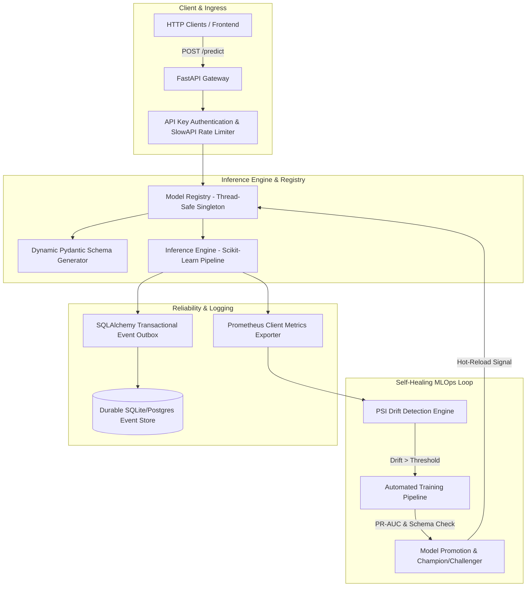

<div align="center">

# ⚡ Enterprise Churn ML System

**An end-to-end Machine Learning & MLOps platform for customer churn prediction, real-time inference, drift monitoring, and an automated model lifecycle.**

> **Scope note.** Serving, the model registry, artifact signing, migrations and the
> event store are production-grade and covered by tests. The automated lifecycle
> runs but is single-node (one elected leader, SQLite by default). See
> [Limitations](#-limitations) for what is verified versus what is not.

[](https://www.python.org/)
[](https://fastapi.tiangolo.com/)
[](https://scikit-learn.org/)
[](https://www.docker.com/)
[](https://github.com/astral-sh/ruff)
[](https://docs.pytest.org/)
[](LICENSE)

[Architecture](#-architecture) • [Quick Start](#-quick-start) • [API Reference](#-api-reference) • [MLOps Lifecycle](#-mlops-lifecycle--drift-detection) • [Observability](#-observability--monitoring) • [Testing](#-testing--quality-assurance)

</div>

---

## 📌 Executive Summary

Predicting customer churn is not just a modeling problem — it is an operational systems challenge. Models degrade as customer behaviors shift, schema mismatches break API contracts, and unmonitored deployments fail silently.

The **Enterprise Churn ML System** bridges the gap between experimental data science and enterprise MLOps. It provides a complete, resilient microservice architecture that continuously:

1. **Ingests & Validates**: Enforces strict Pandera data quality contracts before training or inference.
2. **Trains & Ranks**: Evaluates three candidates on a stratified holdout using PR-AUC with bootstrap confidence intervals, and selects an operating threshold on validation data.
3. **Serves via Async API**: REST inference (~26 ms p50 end-to-end; ~110 rps on 8 workers, ~1,800 rows/s batched) with rate limiting, API-key auth, and a graceful SIGTERM drain.
4. **Monitors Data Drift**: Tracks Population Stability Index (PSI) per feature against baseline distributions in real-time.
5. **Automated lifecycle**: drift check, retraining, champion/challenger comparison behind statistical promotion gates, and rollback — run by a single elected leader.
6. **Ensures Reliability**: Implements a durable transactional outbox event store for asynchronous prediction logging and compliance auditing with PII redaction.

---

## 🏛️ System Architecture

The repository enforces strict separation of concerns across single-purpose domain modules:


```mermaid
flowchart TD
    subgraph ClientLayer ["Client & Ingress"]
        Client[HTTP Clients / Frontend] -->|POST /predict| Gateway[FastAPI Gateway]
        Gateway --> Auth[API Key Authentication & SlowAPI Rate Limiter]
    end

    subgraph ServingLayer ["Inference Engine & Registry"]
        Auth --> ModelRegistry[Model Registry - Thread-Safe Singleton]
        ModelRegistry --> SchemaGen[Dynamic Pydantic Schema Generator]
        ModelRegistry --> Predictor[Inference Engine - Scikit-Learn Pipeline]
    end

    subgraph EventLayer ["Reliability & Logging"]
        Predictor --> Outbox[SQLAlchemy Transactional Event Outbox]
        Outbox --> AuditLog[(Durable SQLite/Postgres Event Store)]
        Predictor --> Metrics[Prometheus Client Metrics Exporter]
    end

    subgraph MLOpsLayer ["Self-Healing MLOps Loop"]
        Metrics --> DriftEngine[PSI Drift Detection Engine]
        DriftEngine -->|Drift > Threshold| RetrainPipeline[Automated Training Pipeline]
        RetrainPipeline -->|PR-AUC & Schema Check| LifecycleManager[Model Promotion & Champion/Challenger]
        LifecycleManager -->|Hot-Reload Signal| ModelRegistry
    end
```

---

## 📦 Tech Stack & Enterprise Components

| Domain | Technology | Enterprise Capability |
| :--- | :--- | :--- |
| **Inference API** | `FastAPI`, `Uvicorn`, `SlowAPI` | Asynchronous REST serving, rate limiting, key auth, OpenAPI specs |
| **ML Framework** | `scikit-learn` | Pipeline modeling (LogisticRegression, RandomForest, GradientBoosting) |
| **Data Quality** | `Pandera`, `Pydantic v2` | Strict runtime schema enforcement for data ingest and API payloads |
| **Experiment Tracking** | `MLflow` | Versioned model artifact storage, metadata logging, stage transitions |
| **Drift Monitoring** | Custom `PSI` Engine | Population Stability Index calculation across numeric feature distributions |
| **Event Outbox** | `SQLAlchemy`, `SQLite / PostgreSQL` | Transactional outbox pattern for durable, fault-tolerant prediction event logs |
| **Observability** | `Prometheus Client` | Native metrics export (`/metrics`) for latency, throughput, and feature drift |
| **Packaging & CI** | `Docker`, `uv`, `Ruff`, `pytest` | Containerized microservices, ultra-fast dependency management, 225-test suite |

---

## ⚡ Quick Start

### Prerequisites

- **Python 3.10+**
- **[uv](https://docs.astral.sh/uv/)** (recommended for 10x faster setup) or standard `pip`

### 1. Clone & Setup Environment

```bash
# Clone the repository
git clone https://github.com/GojoV339/Churn_ML_System.git
cd Churn_ML_System

# Create virtual environment and install dependencies
uv sync --all-extras
```

### 2. Train Initial Baseline Model

Execute the end-to-end training pipeline to ingest data, validate schemas, train candidate models, evaluate metrics, and save versioned artifacts:

```bash
.venv/bin/python -m churn_system.training.train
```

*Output summary (an actual run on the bundled dataset):*
```text
INFO | Stratified split | train=5634 (churn 0.2654) | test=1409 (churn 0.2654) | population churn 0.2654
INFO | Feature schema captured (19 features)
INFO | Threshold selection | objective=fbeta beta=2.00 -> threshold=0.1400 (recall=0.8957)
INFO | Calibration (validation) | mean_predicted=0.2610 actual=0.2654 ratio=0.983 brier=0.1321
INFO | random_forest | pr_auc=0.6733 [0.6205, 0.7231] | recall=0.9332 precision=0.4335 brier=0.1332
INFO | Winner selected: random_forest (pr_auc=0.6733, recall=0.9332)
```

### 3. Promote Candidate to Production

Promote the latest trained model artifact to the production active serving directory:

```bash
.venv/bin/python -c "from churn_system.lifecycle.promote import promote_model; promote_model('churn_model_20260808_180000')"
```

### 4. Launch the Production API Server

```bash
.venv/bin/python -m uvicorn churn_system.api.api:app --host 0.0.0.0 --port 8000 --reload
```

Access interactive documentation and endpoints:
- **Swagger Documentation**: [http://localhost:8000/docs](http://localhost:8000/docs)
- **ReDoc Interface**: [http://localhost:8000/redoc](http://localhost:8000/redoc)
- **System Health**: [http://localhost:8000/health](http://localhost:8000/health)
- **Prometheus Metrics**: [http://localhost:8000/metrics](http://localhost:8000/metrics)

---

## 🔌 API Reference & Usage

### Prediction Endpoint (`POST /predict`)

#### Request Header & Body

```bash
curl -X POST http://localhost:8000/predict \
  -H "Content-Type: application/json" \
  -H "X-API-Key: $CHURN_API_KEY" \
  -d '{
    "Gender": "Female",
    "Senior Citizen": "No",
    "Partner": "Yes",
    "Dependents": "No",
    "Tenure Months": 12,
    "Phone Service": "Yes",
    "Multiple Lines": "No",
    "Internet Service": "Fiber Optic",
    "Online Security": "No",
    "Online Backup": "Yes",
    "Device Protection": "No",
    "Tech Support": "No",
    "Streaming TV": "Yes",
    "Streaming Movies": "Yes",
    "Contract": "Month-to-month",
    "Paperless Billing": "Yes",
    "Payment Method": "Electronic check",
    "Monthly Charges": 85.5,
    "Total Charges": 1026.0
  }'
```

> Geographic fields are no longer part of the request schema — the request model is
> generated from the bundle's `feature_schema` with `extra="forbid"`, so sending
> them returns 422.

#### Response (`200 OK`)

```json
{
  "request_id": "f81d4fae-7dec-11d0-a765-00a0c91e6bf6",
  "churn_probability": 0.7428,
  "prediction": 1,
  "threshold": 0.5,
  "latency_seconds": 0.0038
}
```

### Endpoints Overview

| Endpoint | Method | Auth | Rate Limit | Description |
| :--- | :---: | :---: | :---: | :--- |
| `/` | `GET` | — | — | System metadata & operational status |
| `/health` | `GET` | — | — | Liveness probe — the process is up |
| `/ready` | `GET` | — | — | Readiness probe — scores a real row, 503 if the model cannot serve |
| `/metrics` | `GET` | — | — | Prometheus scrape endpoint |
| `/predict` | `POST` | ✅ | 120/min | Single-customer churn inference |
| `/predict/batch` | `POST` | ✅ | 120/min | Batch inference (up to `CHURN_MAX_BATCH_SIZE`, default 100) |
| `/explain` | `POST` | ✅ | 120/min | SHAP explanation for one prediction |
| `/explain/global` | `GET` | ✅ | 120/min | Global feature importance, top `?limit=` (default 50) |
| `/feedback/{request_id}` | `POST` | ✅ | 120/min | Attach ground truth to a past prediction |
| `/monitoring/dashboard` | `GET` | ✅ | — | Consolidated monitoring reports |
| `/admin/reload-model` | `POST` | 🔐 admin | 5/min | Hot-reload the production model |
| `/subject/{subject_id}` | `DELETE` | 🔐 admin | 30/min | Erase all stored predictions for a customer (GDPR) |

Endpoints marked 🔐 require `CHURN_ADMIN_API_KEY` when it is set, so a leaked
prediction key cannot force model reloads or delete data.

---

## 📊 Model Evaluation

**ROC-AUC is deliberately not the headline metric.** On this dataset it moved
0.002 between a model that caught 9.7% of churners and one that caught 93% — it is
invariant to both the base rate and the operating point, so it cannot tell you
whether the model is useful. PR-AUC, recall and precision at the selected
threshold are the numbers that matter.

| Metric | Value | Note |
| :--- | ---: | :--- |
| PR-AUC | **0.673** | Selection metric. Base rate 0.265, so the chance floor is 0.265 |
| Recall | **0.933** | At the selected threshold |
| Precision | 0.434 | Deliberate trade — see threshold below |
| F1 | 0.592 | |
| ROC-AUC | 0.853 | Reported for comparability, not used for selection |
| Brier score | 0.133 | Probability quality |
| Calibration ratio | 1.01 | Mean predicted / actual rate; 1.0 is perfect |

### Methodology

- **Stratified holdout**, stratified on `Churn Value`. The earlier implementation
  sorted by `Tenure Months` and cut at the 80th percentile, calling it
  "time-aware". It was not: tenure is a per-customer *duration* at a single
  snapshot, so ordering by it orders rows by accumulated survival — a proxy for
  *not* having churned. That produced train churn 31.5% vs test 6.6% and made every
  reported metric, the threshold, and the promotion gate incomparable.
  `Tenure Months` remains a model feature; it is simply no longer the split axis.
- **Threshold selected on validation data**, never on the test set, and stored in
  `metadata.json` so it travels with the model it was tuned for. Default objective
  is F-beta (β=2) with a 0.50 recall floor — a deliberate "a missed churner costs
  more than an unnecessary retention offer" posture. It is configurable under
  `threshold_selection`; set `objective: f1` for a balanced operating point.
- **Bootstrap confidence intervals** on the selection metric, because with ~370
  positives the PR-AUC noise floor is roughly ±0.08. A promotion gate comparing
  point estimates alone would promote on noise.
- **Calibration measured before it is corrected.** A correction is applied only if
  the measured deviation exceeds the configured tolerance.

### Excluded features

| Excluded | Why |
| :--- | :--- |
| `Churn Label`, `Churn Score`, `Churn Reason`, `CLTV` | Target leakage. `Churn Score` is IBM's own propensity score — keeping it yields a ~1.0 ROC-AUC and a fraudulent model |
| `Country`, `State`, `City`, `Zip Code`, `Lat Long`, `Latitude`, `Longitude` | 4,428 of 4,478 encoded columns on 5,634 rows — memorisation, not learning. Also embedded customer geography as plaintext inside `model.pkl` |
| `CustomerID`, `Count` | Row identifier and a constant |

---

## 🔄 MLOps Lifecycle & Drift Detection

The platform features an automated **Population Stability Index (PSI)** data drift monitoring system designed to detect feature distribution shifts before they cause silent prediction failures.

### Drift Threshold Spectrum

$$\text{PSI} = \sum \left( (P_{\text{actual}} - P_{\text{expected}}) \times \ln\left(\frac{P_{\text{actual}}}{P_{\text{expected}}}\right) \right)$$

- **$\text{PSI} < 0.10$**: **Nominal** — Baseline distribution matches inference distribution.
- **$0.10 \le \text{PSI} \le 0.20$**: **Moderate Shift** — Triggers warning alert metrics in Prometheus.
- **$\text{PSI} > 0.20$**: **Significant Drift** — Automates re-training workflow trigger.

A minimum production sample size (`monitoring.min_production_samples`, default 20)
must be met before drift is evaluated at all — PSI against a handful of rows is
large regardless of real drift, and would otherwise trigger spurious retraining.

### Safe Champion vs. Challenger Promotion

When retraining is executed:
1. **Schema Contract Validation**: The candidate must match the production feature names, types, and ordering; a mismatch refuses the promotion and leaves the incumbent serving.
2. **Performance Gating**: The challenger must improve on `model_promotion.metric` (default `pr_auc`) by at least `model_promotion.min_improvement` (default `0.0`, i.e. any strict improvement).
3. **Atomic Swap**: The bundle is staged in a sibling directory and moved into place with directory renames, so an interrupted promotion can never leave production without a model.
4. **Hot Reload**: The scheduler notifies each serving instance listed in `CHURN_RELOAD_ENDPOINTS`, which reloads the model and invalidates the feature-contract and SHAP caches in one operation.
5. **Automated Rollback**: An unhealthy model is reverted to the last *distinct* lineage version. Rollback is skipped in a cycle that just promoted, so a fresh model is not immediately undone.

### Ground Truth

Drift detection compares input distributions; it cannot tell whether a prediction
was *right*. Report observed outcomes to close that loop:

```bash
curl -X POST http://localhost:8000/feedback/<request_id> \
  -H "X-API-Key: $CHURN_API_KEY" \
  -H "Content-Type: application/json" \
  -d '{"label": 1}'
```

Labelled predictions are merged into the retraining dataset, which the training
pipeline prefers over the original CSV when present.

---

## 📊 Observability & Monitoring

The system exposes native Prometheus metrics out-of-the-box:

```text
# HELP churn_api_requests_total Total API requests by path, method and status
# TYPE churn_api_requests_total counter
churn_api_requests_total{path="/predict",method="POST",status="200"} 1420

# HELP churn_api_request_latency_seconds Request latency histogram
# TYPE churn_api_request_latency_seconds histogram
churn_api_request_latency_seconds_bucket{path="/predict",le="0.005"} 1380

# HELP churn_drifting_feature_count Number of drifting features detected
# TYPE churn_drifting_feature_count gauge
churn_drifting_feature_count 1

# HELP churn_event_write_failures_total Prediction events that could not be persisted
# TYPE churn_event_write_failures_total counter
churn_event_write_failures_total 0
```

Pre-configured alert rules at [`observability/prometheus/alert_rules.yml`](observability/prometheus/alert_rules.yml) notify on:
- **`ChurnApiHighErrorRate`** — 5xx rate on `/predict` above 2% for 10m
- **`ChurnApiHighLatencyP95`** — p95 latency above 0.5s for 10m
- **`ChurnModelDriftDetected`** — 2 or more drifting features for 30m

> **Note on metric scope.** Drift and data-quality gauges are set by the lifecycle
> process, not the API. Prometheus scrapes the API only, so those series need a
> Pushgateway (or a scrape target on the scheduler) before the drift alert can fire
> in a multi-process deployment.

---

## 🐳 Containerized Deployment

The default stack is the API, the outbox worker, and Prometheus. Training, the
lifecycle scheduler, and migrations sit behind profiles so they are opt-in.

```bash
# Apply database migrations first (required on a fresh volume and after upgrades)
docker compose --profile migrate run --rm migrate

# Build and start api + worker + prometheus
docker compose up -d --build

# Inspect running container logs
docker compose logs -f api

# One-shot training job
docker compose --profile training run --rm train

# Run the drift → retrain → promote loop continuously
docker compose --profile lifecycle up -d scheduler
```

> `CHURN_API_KEY`, `CHURN_ARTIFACT_SIGNING_KEY` and `CHURN_SUBJECT_KEY_SALT` have
> no defaults. The stack refuses to start without them, so a missing `.env` can
> never silently bring up an unauthenticated API or one that loads an unverified
> model. For local development set `CHURN_ALLOW_ANONYMOUS=1` instead of an API key;
> generate the other two with
> `python -c "import secrets; print(secrets.token_hex(32))"`.

### Horizontal scale-out

Two hard prerequisites for more than one API replica: PostgreSQL instead of SQLite
(one writer, one host), and a **shared** model volume so every replica serves the
same champion. The overlay configures both, plus an nginx balancer with health
checking that Compose's DNS round-robin does not provide.

```bash
docker compose -f docker-compose.yml -f docker-compose.scale.yml \
    --profile scale up -d --build --scale api=3
```

Kubernetes manifests — Deployment, HPA, PodDisruptionBudget, migration Job, and a
headless Service so promotion reloads reach *every* replica — are in
[`deploy/kubernetes/`](deploy/kubernetes/). Measured capacity, tuning knobs and
what does **not** scale are in [`docs/scaling.md`](docs/scaling.md).

### Environment Configuration Options

All settings live in `src/churn_system/config/settings.yaml` and can be overridden
via environment variables:

| Environment Variable | Default | Purpose |
| :--- | :--- | :--- |
| `CHURN_API_KEY` | *(required)* | API key clients must send as `X-API-Key` |
| `CHURN_ALLOW_ANONYMOUS` | `0` | Explicitly run with authentication disabled (local dev only) |
| `CHURN_ADMIN_API_KEY` | `""` | Separate credential for `/admin/*`; falls back to `CHURN_API_KEY` |
| `CHURN_INFERENCE_THRESHOLD` | `0.5` | Classification probability decision threshold |
| `CHURN_DISABLE_RATE_LIMIT` | `0` | Set to `1`/`true` to disable rate limiting. `0` keeps it **on** |
| `CHURN_MAX_BODY_BYTES` | `8388608` | Reject request bodies larger than this |
| `CHURN_LOG_FORMAT` | `text` | Logging mode (`json` for production) |
| `CHURN_EVENT_STORE_DATABASE_URL` | `sqlite:///./data/churn_events.db` | SQLAlchemy URL for the event store |
| `CHURN_RELOAD_ENDPOINTS` | `""` | Comma-separated `/admin/reload-model` URLs notified after promotion |
| `CHURN_SUBJECT_KEY_SALT` | *(required)* | Salt for the pseudonymous subject key. Fails closed — no default |
| `CHURN_ARTIFACT_SIGNING_KEY` | *(required)* | HMAC key verified **before** the model is unpickled. Fails closed |
| `CHURN_STRICT_REQUEST_SCHEMA` | `0` | `1` rejects the deprecated geographic fields instead of ignoring them |
| `CHURN_MAX_BATCH_SIZE` | `100` | Maximum rows per `/predict/batch` request |
| `CHURN_BATCH_CHUNK_SIZE` | `= CHURN_MAX_BATCH_SIZE` | Rows per inference call. A **memory** bound — lowering it reduces throughput |
| `FORWARDED_ALLOW_IPS` | `127.0.0.1` | Peers permitted to set `X-Forwarded-For`. Never `*` |

---

## 🧪 Testing & Quality Assurance

The codebase maintains strict code quality standards, validated with comprehensive unit, integration, and concurrency tests.

```bash
# Execute full pytest suite (282 tests; 307 with a live PostgreSQL server)
.venv/bin/python -m pytest tests/ -v

# With the coverage gate CI enforces
.venv/bin/python -m pytest tests/ --cov=churn_system --cov-fail-under=70

# Static linting and import formatting
.venv/bin/python -m ruff check src tests scripts alembic
```

### Test Coverage Highlights
- **API & Security**: fail-closed auth, per-endpoint authorization, body-size limits, and a uniform error envelope.
- **Inference & Contracts**: artifact validation, dynamic schema generation, and feature ordering.
- **Concurrency**: writer liveness under sustained reader load, and mutual exclusion during hot reload.
- **Monitoring & Drift**: PSI correctness including out-of-range, empty, and constant inputs, plus the minimum-sample guard on the retraining decision.
- **Lifecycle**: the schema interlock refusing a promotion, atomic swap cleanup, and the real rollback restore path.
- **Events & Outbox**: lease-based claiming under concurrent workers, retry release, and label recording.

---

## 📁 Repository Structure

```text
Churn_Ml_System/
├── src/churn_system/          # Core package library
│   ├── api/                   # FastAPI endpoints, middleware, schema generators
│   ├── config/                # YAML configuration & env variable overrides
│   ├── events/                # Transactional outbox event store & PII redaction
│   ├── explainability/        # SHAP explanation engines
│   ├── features/              # Deterministic feature builder (training & serving)
│   ├── inference/             # Model contract verification & inference logic
│   ├── lifecycle/             # Orchestrator, promotion, rollback & lineage tracking
│   ├── logging/               # Structured JSON & console loggers
│   ├── monitoring/            # PSI data drift engine & health checkers
│   ├── observability/         # Prometheus metrics collection
│   ├── training/              # Multi-step scikit-learn training pipeline
│   └── validation/            # Pandera data validation schemas
├── tests/                     # 70+ automated pytest unit & integration tests
├── data/                      # Dataset files & baseline reference distributions
├── models/                    # Versioned experiments & production active bundles
├── docs/                      # Architectural documentation & Graphviz diagrams
├── observability/             # Prometheus scrape configs & alert rules
├── docker-compose.yml         # Container orchestration manifest
├── Dockerfile                 # Production API microservice container
├── pyproject.toml             # Dependencies, ruff, and pytest configurations
└── README.md                  # System documentation
```

---

## ⚠️ Limitations

Stated plainly, because the difference matters when evaluating this repository.

**Verified by tests and measurement**
- Train/serve feature equality (asserted bit-for-bit), no target leakage
- Deterministic training (identical `model.pkl` across runs)
- Artifact signature verification before `pickle.load`, fail-closed
- Atomic model-bundle reload; model, schema and threshold cannot be observed out of step
- Promotion gates including statistical significance
- Alembic `upgrade → downgrade → upgrade` round-trip on **both** SQLite and PostgreSQL
- **PostgreSQL against a live server**: migrations produce a schema with zero
  autogenerate drift from the ORM, payload columns are genuinely `jsonb`
  (containment queries proven), and `pool_pre_ping` recovers from a
  server-terminated backend
- **Outbox claiming under real MVCC**: 8 concurrent workers over 240 events on live
  PostgreSQL, no event claimed twice and none stranded; expired leases reclaimed;
  exhausted events dead-lettered
- Distributed leader election via PostgreSQL advisory lock, including release on a
  killed connection and loss detection by the incumbent
- Backward compatibility of the request schema across the 26 → 19 feature change:
  old and new clients receive identical predictions
- Throughput and latency measured end-to-end over HTTP — see [docs/scaling.md](docs/scaling.md)

**Runs, but single-node by default**
- **The event store defaults to SQLite**, which permits one writer database-wide
  and cannot back more than one API replica. PostgreSQL is now validated against a
  live server; install with `pip install "churn-ml-system[postgres]"` and use
  [`docker-compose.scale.yml`](docker-compose.scale.yml).
- **One scheduler, by design.** On PostgreSQL leadership is a cluster-wide advisory
  lock; on SQLite it falls back to a per-host `flock`, which is all a single-file
  database can support anyway.
- **Outbox delivery is at-least-once**, not exactly-once. Claim and mark-processed
  are separate transactions, so a crash between the side effect and the mark
  redelivers. Any real publish target must be idempotent.
- **~110 rps single-prediction on one 12-core host** (8 uvicorn workers).
  `predict_proba` holds the GIL, so a single process is capped near `1 / latency`
  — capacity comes from processes and replicas, not threads. Batching is worth
  ~53x per row.

**Not implemented / not verified**
- No CD pipeline; deployment is `docker compose up` or `kubectl apply`
- **Kubernetes manifests are provided but have not been applied to a live cluster** —
  they are YAML-valid only. `ReadWriteMany` storage is assumed and not tested.
- The nginx scale-out overlay is config-valid but has not been run under sustained load
- **Customer geography remains in this repository's git history** inside model
  artifacts committed before the geographic features were removed. Removing it
  requires a history rewrite and a force-push; the current model no longer contains
  or accepts those features, but the historical blobs are still reachable.

---

## 📄 License

Distributed under the **MIT License**. See [LICENSE](LICENSE) for full details.

---

<div align="center">
Built with ❤️ for scalable, reliable, and observable Machine Learning Systems.
</div>
