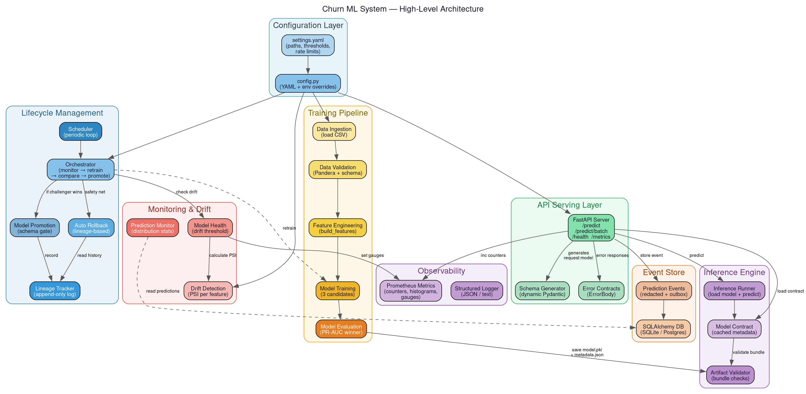

# Churn ML System — Developer Documentation

> **Last Updated**: June 2026

Welcome to the internal developer documentation for the **Churn ML System**. This
directory contains one document per source package, covering every file, function,
and design decision in detail.

---

## System Architecture



---

## How to Read These Docs

Each document is named after the package it describes. Start with the architecture
diagram above, then dive into whichever package is relevant to your task.

## Document Index

| Document | Package | What It Covers |
|----------|---------|----------------|
| [api.md](api.md) | `churn_system.api` | FastAPI server, error contracts, dynamic schema generation |
| [serving.md](serving.md) | `churn_system.serving` | Thread-safe ModelRegistry, hot-reloading with ReadWriteLock |
| [workers.md](workers.md) | `churn_system.workers` | Asynchronous Outbox consumer, distributed concurrency safety |
| [config.md](config.md) | `churn_system.config` | YAML configuration, environment variable overrides |
| [training.md](training.md) | `churn_system.training` | Full training pipeline, steps, candidate models, evaluation |
| [features.md](features.md) | `churn_system.features` | Shared feature builder used by both training and inference |
| [inference.md](inference.md) | `churn_system.inference` | Offline inference helpers and model contract management |
| [events.md](events.md) | `churn_system.events` | Durable event store (SQLAlchemy/SQLite), outbox pattern |
| [monitoring.md](monitoring.md) | `churn_system.monitoring` | Drift detection (PSI), model health, prediction monitoring |
| [lifecycle.md](lifecycle.md) | `churn_system.lifecycle` | Orchestrator, promotion, rollback, lineage, scheduling |
| [validation.md](validation.md) | `churn_system.validation` | Pandera schema enforcement from YAML definitions |
| [observability.md](observability.md) | `churn_system.observability` | Prometheus counters, histograms, gauges |
| [logging.md](logging.md) | `churn_system.logging` | Rotating file loggers, JSON structured logging |
| [pipelines.md](pipelines.md) | `churn_system.pipelines` | High-level pipeline wrappers (training, inference, monitoring) |
| [utils.md](utils.md) | `churn_system.utils` | Retry with exponential backoff |
| [root_modules.md](root_modules.md) | `churn_system` (root) | `schema.py`, `artifacts.py`, `mlflow_utils.py` |

---

## Diagram Sources

All architecture diagrams are maintained as Graphviz `.dot` source files in
[`docs/diagrams/`](diagrams/). Generated PNG images are in [`docs/images/`](images/).

To regenerate all diagrams after editing a `.dot` file:

```bash
cd docs
for f in diagrams/*.dot; do
  name=$(basename "$f" .dot)
  dot -Tpng -Gdpi=150 "$f" -o "images/${name}.png"
done
```

| Diagram | Source | Image |
|---------|--------|-------|
| System Architecture | [system_architecture.dot](diagrams/system_architecture.dot) | [system_architecture.png](images/system_architecture.png) |
| Training Pipeline | [training_pipeline.dot](diagrams/training_pipeline.dot) | [training_pipeline.png](images/training_pipeline.png) |
| API Request Flow | [api_flow.dot](diagrams/api_flow.dot) | [api_flow.png](images/api_flow.png) |
| Lifecycle Flow | [lifecycle_flow.dot](diagrams/lifecycle_flow.dot) | [lifecycle_flow.png](images/lifecycle_flow.png) |
| Monitoring & Drift | [monitoring_flow.dot](diagrams/monitoring_flow.dot) | [monitoring_flow.png](images/monitoring_flow.png) |
| Event Store | [event_store.dot](diagrams/event_store.dot) | [event_store.png](images/event_store.png) |
| Config System | [config_flow.dot](diagrams/config_flow.dot) | [config_flow.png](images/config_flow.png) |

---

## Quick Reference — Key Entry Points

| Task | Command |
|------|---------|
| Run tests | `.venv/bin/python -m pytest tests/ -v` |
| Lint check | `.venv/bin/python -m ruff check src tests scripts` |
| Train a model | `.venv/bin/python -m churn_system.training.train` |
| Start API | `.venv/bin/python -m uvicorn churn_system.api.api:app --port 8000` |
| Run lifecycle | `.venv/bin/python -m churn_system.lifecycle.orchestrator` |
| Run monitoring | `.venv/bin/python -m churn_system.pipelines.monitoring_pipeline` |
| Docker (API) | `docker compose up -d` |
| Docker (Train) | `docker compose run --rm train` |
