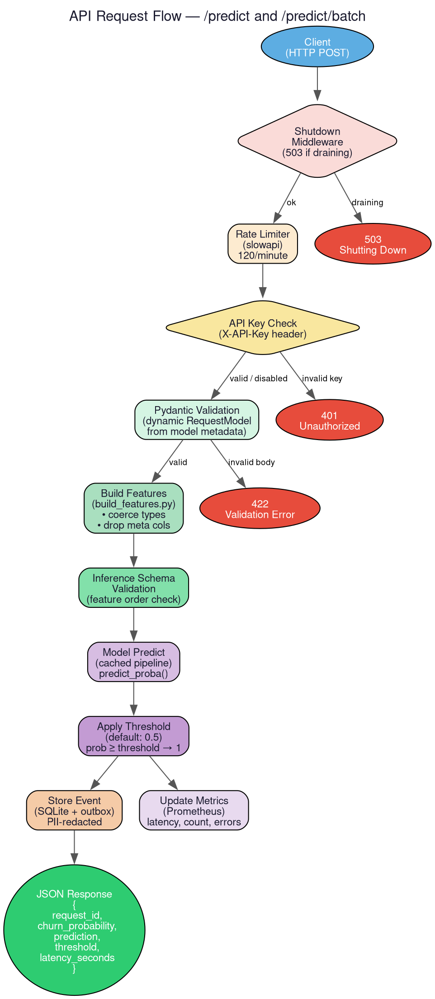

# `churn_system.api` — HTTP Serving Layer

> **Location**: `src/churn_system/api/`
> **Files**: `api.py`, `errors.py`, `schema_generator.py`

---

## Overview

The `api` package is the public-facing HTTP interface of the Churn ML System. It
exposes a FastAPI application that accepts customer feature data, runs it through
the production model, and returns churn probability predictions. It includes
authentication, rate limiting, graceful shutdown, batch processing, and structured
error responses.

---

## File: `api.py`

**Purpose**: Defines the FastAPI application, all HTTP endpoints, middleware, and
the core request handling logic.

### Endpoints

| Route | Method | Description |
|-------|--------|-------------|
| `/` | GET | Basic health check — returns `{"status": "ok"}` |
| `/health` | GET | Readiness/liveness probe for container orchestrators (Kubernetes, ECS) |
| `/metrics` | GET | Prometheus metrics in text exposition format |
| `/predict` | POST | Single-row churn prediction |
| `/predict/batch` | POST | Batch prediction (up to `CHURN_MAX_BATCH_SIZE` rows) |
| `/predict` | GET | Helpful hint directing users to POST and `/docs` |

### Key Functions and Components

#### `_handle_sigterm(signum, frame)`
- **What it does**: Signal handler registered for `SIGTERM`. Sets the global
  `_shutting_down` flag to `True`.
- **Why it matters**: When a container orchestrator (Docker, Kubernetes) sends
  SIGTERM to shut down the container, this handler ensures the server stops
  accepting new requests but allows in-flight requests to complete — preventing
  dropped connections.

#### `shutdown_middleware(request, call_next)`
- **What it does**: FastAPI middleware that intercepts every incoming request. If
  the server is shutting down, it returns HTTP 503 for all routes except `/health`
  and `/metrics`.
- **Why `/health` and `/metrics` are exempted**: The orchestrator needs to keep
  polling these endpoints during the drain period to know when the server has
  fully stopped.

#### `verify_api_key(x_api_key)`
- **What it does**: Dependency-injected function that checks the `X-API-Key`
  header against the `CHURN_API_KEY` environment variable.
- **Behavior**: If `CHURN_API_KEY` is not set, authentication is disabled entirely
  (useful for local development). If set, missing or mismatched keys return 401.

#### `get_model()`
- **What it does**: Loads the production model pickle from disk using
  `CONFIG["paths"]["production_model"]`.
- **Caching**: Decorated with `@lru_cache(maxsize=1)` — the model is loaded once
  and reused for all subsequent predictions. This avoids the overhead of
  deserializing the model on every request.

#### `predict(request, payload, _)`
- **What it does**: Handles single-row prediction requests.
- **Flow**: Pydantic validation → `build_features()` → `validate_inference_data()`
  → `model.predict_proba()` → threshold comparison → store event → return JSON.
- **Metrics updated**: `REQUESTS_TOTAL`, `REQUEST_LATENCY_SECONDS`,
  `INFERENCE_ERRORS_TOTAL`.
- **Used by**: Any client sending a POST to `/predict`.

#### `predict_batch(request, payloads, _)`
- **What it does**: Handles batch prediction requests (a JSON array of feature
  rows).
- **Batch limit**: Controlled by `CHURN_MAX_BATCH_SIZE` env var (default: 100).
  Requests exceeding this are rejected with HTTP 400.
- **Efficiency**: Constructs a single Pandas DataFrame from all rows and runs
  `predict_proba()` once on the entire batch, avoiding per-row overhead.
- **Used by**: Downstream services that need to score multiple customers at once.

---

## File: `errors.py`

**Purpose**: Defines the standard error response body used by all error handlers
in the API.

### Class: `ErrorBody(BaseModel)`

A Pydantic model with three fields:

| Field | Type | Description |
|-------|------|-------------|
| `error_code` | `str` | Machine-readable error identifier (e.g. `"unauthorized"`, `"invalid_input"`, `"inference_error"`) |
| `message` | `str` | Human-readable summary |
| `detail` | `str | None` | Additional context (e.g. validation error details) |

**Used by**: `api.py` — every `HTTPException` raised in the API wraps its detail
in an `ErrorBody.model_dump()` call, ensuring clients always receive a consistent
JSON error shape.

---

## File: `schema_generator.py`

**Purpose**: Dynamically generates the Pydantic request model (`RequestModel`)
used by `/predict` and `/predict/batch` endpoints. Instead of hardcoding which
fields the API accepts, this module reads the production model's `metadata.json`
and generates typed fields automatically.

### Key Functions

#### `_load_metadata() → dict`
- Delegates to `load_model_contract()` from the inference package.
- Returns the cached production metadata dictionary.

#### `load_feature_schema() → list[str]`
- Returns the ordered list of feature names expected by the production model.

#### `_load_feature_types_from_reference(feature_schema) → dict[str, str]`
- Reads the training reference CSV (`CONFIG["paths"]["training_reference"]`).
- Infers the Python type of each feature column (`int`, `float`, `str`, `bool`).
- Falls back to `str` for all features if the reference file is missing.

#### `generate_request_model() → type[BaseModel]`
- **What it does**: Uses `pydantic.create_model()` to dynamically build a Pydantic
  model class at import time. Each feature becomes a typed, required field.
- **Why dynamic**: When the model is retrained and features change, the API
  request schema updates automatically — no code changes needed.
- **Extra fields**: The model is configured with `extra="forbid"`, meaning clients
  cannot send unrecognized fields. This prevents silent data errors.

**Used by**: `api.py` imports `RequestModel = generate_request_model()` at module
load time and uses it as the type annotation for the `/predict` and
`/predict/batch` request bodies.
