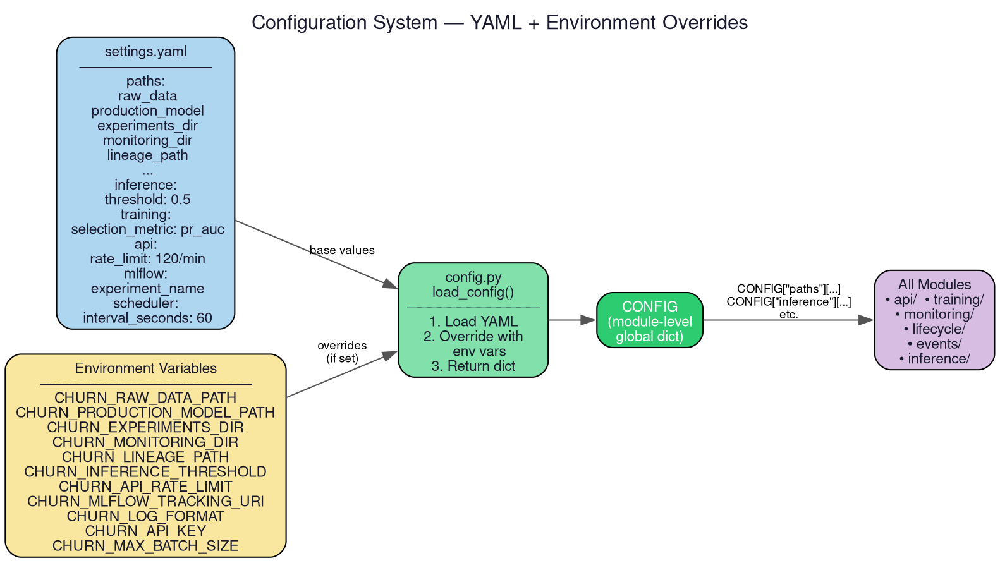

# `churn_system.config` — Configuration Management

> **Location**: `src/churn_system/config/`
> **Files**: `config.py`, `settings.yaml`

---

## Overview

The `config` package is the **single source of truth** for all tunable parameters
in the system. It implements a two-layer configuration strategy:

1. **Base values** are defined in `settings.yaml` (checked into version control).
2. **Environment variable overrides** allow containers, CI, and cloud deployments
   to change any setting without modifying YAML.

Every module in the system imports `CONFIG` from this package rather than
hardcoding paths, thresholds, or URIs.

---

## File: `settings.yaml`

**Purpose**: Declares all default configuration values in a human-readable format.

### Sections

| Section | Keys | Description |
|---------|------|-------------|
| `paths` | `raw_data`, `retraining_data`, `training_reference`, `production_model`, `experiments_dir`, `monitoring_dir`, `lineage_path`, `prediction_log_csv` | File system paths for all data and model artifacts |
| `inference` | `threshold` | Probability cutoff for binary classification (default: `0.5`) |
| `training` | `min_rows`, `min_class_count`, `selection_metric` | Training guardrails and winner selection metric (default: `pr_auc`) |
| `model_promotion` | `metric`, `min_improvement` | Which metric to use for champion-vs-challenger comparison |
| `api` | `rate_limit` | SlowAPI rate limit string (default: `120/minute`) |
| `event_store` | `database_url` | SQLAlchemy connection string (default: SQLite) |
| `mlflow` | `tracking_uri`, `experiment_name`, `registered_model_name` | MLflow experiment configuration |
| `logging` | `training`, `api`, `monitoring`, `lifecycle` | Per-subsystem log file names |
| `scheduler` | `interval_seconds` | How often the lifecycle orchestrator runs (default: `60`) |

---

## File: `config.py`

**Purpose**: Loads `settings.yaml`, applies environment variable overrides, and
exports the `CONFIG` dictionary used by every module.

### Key Functions

#### `load_config() → dict`
1. Opens and parses `settings.yaml` using `yaml.safe_load()`.
2. Iterates over `PATH_ENV_OVERRIDES` — a mapping of config keys to environment
   variable names (e.g. `"raw_data"` → `"CHURN_RAW_DATA_PATH"`). If the env var
   is set, it overwrites the YAML value.
3. Applies typed overrides for non-path settings:
   - `_set_float_if_env()` for thresholds and improvement minimums
   - `_set_int_if_env()` for scheduler intervals and row counts
   - `_set_if_env()` for string values like URIs and rate limits
4. Returns the final merged dictionary.

#### `CONFIG = load_config()`
- Module-level constant evaluated once at import time.
- Every module does `from churn_system.config.config import CONFIG` to access
  configuration values.

### Environment Variable Reference

| Variable | Config Path | Type | Example |
|----------|-------------|------|---------|
| `CHURN_RAW_DATA_PATH` | `paths.raw_data` | path | `data/raw.csv` |
| `CHURN_RETRAINING_DATA_PATH` | `paths.retraining_data` | path | `data/retrain.csv` |
| `CHURN_TRAINING_REFERENCE_PATH` | `paths.training_reference` | path | `data/ref.csv` |
| `CHURN_PRODUCTION_MODEL_PATH` | `paths.production_model` | path | `models/prod/model.pkl` |
| `CHURN_EXPERIMENTS_DIR` | `paths.experiments_dir` | path | `models/experiments` |
| `CHURN_MONITORING_DIR` | `paths.monitoring_dir` | path | `models/monitoring` |
| `CHURN_LINEAGE_PATH` | `paths.lineage_path` | path | `models/lineage.json` |
| `CHURN_PREDICTION_LOG_CSV` | `paths.prediction_log_csv` | path | `data/preds.csv` |
| `CHURN_INFERENCE_THRESHOLD` | `inference.threshold` | float | `0.6` |
| `CHURN_API_RATE_LIMIT` | `api.rate_limit` | string | `"200/minute"` |
| `CHURN_EVENT_STORE_DATABASE_URL` | `event_store.database_url` | string | `postgresql://...` |
| `CHURN_MLFLOW_TRACKING_URI` | `mlflow.tracking_uri` | string | `http://mlflow:5000` |
| `CHURN_SCHEDULER_INTERVAL_SECONDS` | `scheduler.interval_seconds` | int | `300` |
| `CHURN_TRAINING_SELECTION_METRIC` | `training.selection_metric` | string | `"roc_auc"` |
| `CHURN_MODEL_PROMOTION_METRIC` | `model_promotion.metric` | string | `"pr_auc"` |
| `CHURN_MODEL_PROMOTION_MIN_IMPROVEMENT` | `model_promotion.min_improvement` | float | `0.02` |
| `CHURN_API_KEY` | *(checked in api.py)* | string | `"my-secret-key"` |
| `CHURN_LOG_FORMAT` | *(checked in logger.py)* | string | `"json"` |
| `CHURN_MAX_BATCH_SIZE` | *(checked in api.py)* | int | `100` |
