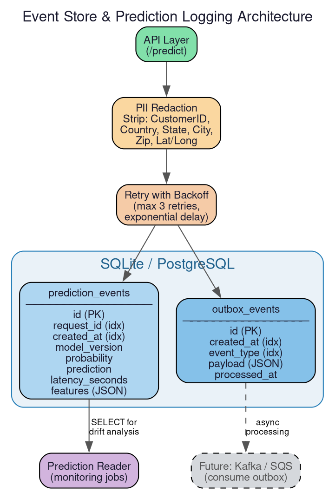

# `churn_system.events` — Durable Event Store

> **Location**: `src/churn_system/events/`
> **Files**: `db.py`, `predictions.py`



---

## Overview

The `events` package implements **durable, structured prediction logging** using
SQLAlchemy and SQLite (swappable to PostgreSQL via configuration). Every prediction
made by the API is stored as a database row with PII redacted, alongside an
**outbox event** for future async processing.

This replaces naive CSV-append logging, providing ACID guarantees, indexed
queries, and a foundation for event-driven architectures.

---

## File: `db.py`

**Purpose**: Defines the database engine, session factory, ORM models, and
initialization logic.

### Function: `_db_url() → str`

- Reads the database URL from `CONFIG["event_store"]["database_url"]`.
- Defaults to `sqlite:///./data/churn_events.db`.
- Can be overridden with `CHURN_EVENT_STORE_DATABASE_URL` env var to point to
  PostgreSQL or any SQLAlchemy-compatible database.

### Constants

- **`ENGINE`**: SQLAlchemy engine instance, created once at import time.
- **`SessionLocal`**: Session factory configured with `autocommit=False`,
  `autoflush=False` — transactions must be explicitly committed.

### ORM Model: `PredictionEvent`

| Column | Type | Description |
|--------|------|-------------|
| `id` | Integer (PK) | Auto-incrementing primary key |
| `request_id` | String(64), indexed | UUID linking to the API request |
| `created_at` | DateTime(tz), indexed | UTC timestamp of the prediction |
| `model_version` | String(64), nullable | Which model version served this request |
| `probability` | Float | Predicted churn probability |
| `prediction` | Integer | Binary prediction (0 or 1) |
| `latency_seconds` | Float | End-to-end inference latency |
| `features` | JSON | Redacted feature values (no PII) |

### ORM Model: `OutboxEvent`

| Column | Type | Description |
|--------|------|-------------|
| `id` | Integer (PK) | Auto-incrementing primary key |
| `created_at` | DateTime(tz), indexed | When the event was created |
| `event_type` | String(64), indexed | Event category (e.g. `"prediction_made"`) |
| `payload` | JSON | Event data (request_id, model_version, probability, prediction) |
| `processed_at` | DateTime(tz), nullable | Set when an async consumer processes the event |

The outbox pattern allows future integration with message brokers (Kafka, SQS)
without changing the API code — a separate consumer reads unprocessed outbox
rows and publishes them.

### Function: `init_db() → None`

- For SQLite: ensures the parent directory of the database file exists.
- Calls `Base.metadata.create_all()` to create tables if they don't exist.
- Safe to call multiple times (idempotent).
- **Used by**: `predictions.py` before every write.

### Function: `now_utc() → datetime`

- Returns the current UTC timestamp with timezone info.

---

## File: `predictions.py`

**Purpose**: High-level function for storing prediction events with PII redaction
and retry logic.

### Constant: `SENSITIVE_KEYS`

```python
SENSITIVE_KEYS = frozenset({
    "CustomerID", "Country", "State", "City",
    "Zip Code", "Lat Long", "Latitude", "Longitude",
})
```

These fields are stripped from the features before storage to comply with data
privacy requirements.

### Function: `_redact(features) → dict`

- Filters out all keys in `SENSITIVE_KEYS`.
- Returns only non-PII feature values.

### Function: `store_prediction_event(...) → None`

**Parameters**: `request_id`, `raw_features`, `probability`, `prediction`,
`latency_seconds`.

**Steps**:
1. Calls `init_db()` to ensure tables exist.
2. Loads the current model version from the model contract.
3. Redacts sensitive fields from the raw features.
4. Opens a database session and inserts both a `PredictionEvent` and an
   `OutboxEvent` in the same transaction.
5. Commits the transaction.

**Retry logic**: The entire write operation is wrapped in `retry_with_backoff()`
(from `utils/retry.py`) with:
- Max 3 retries
- 0.3s base delay (exponential)
- Retries on `OperationalError` (DB lock contention) and `OSError` (filesystem)

**Used by**: `api/api.py` after every successful prediction.
