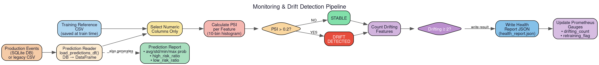

# `churn_system.monitoring` — Drift Detection & Model Health

> **Location**: `src/churn_system/monitoring/`
> **Files**: `drift.py`, `model_health.py`, `prediction_monitor.py`,
> `prediction_reader.py`, `prediction_store.py`

---

## Overview

The `monitoring` package detects when the production model's performance may be
degrading by comparing the statistical distribution of live prediction data
against the original training data. It uses **Population Stability Index (PSI)**
as the drift metric and triggers retraining recommendations when enough features
have drifted.

---

## File: `drift.py`

**Purpose**: Implements Population Stability Index (PSI) calculation and
feature-level drift detection.

### What is PSI?

PSI measures how much a feature's distribution has shifted between two datasets.
It works by:
1. Binning the expected (training) distribution into histogram buckets.
2. Binning the actual (production) distribution using the same bucket edges.
3. Computing the KL-divergence-like sum: `Σ (actual% - expected%) × ln(actual% / expected%)`

| PSI Value | Interpretation |
|-----------|----------------|
| < 0.1 | No significant change |
| 0.1 – 0.2 | Moderate shift — monitor closely |
| > 0.2 | Significant drift — action needed |

### Constant: `PSI_THRESHOLD = 0.2`

Features with PSI above this threshold are flagged as drifting.

### Function: `calculate_psi(expected, actual, bins=10) → float`

- Computes PSI between two pandas Series.
- Uses `np.histogram()` with configurable bin count.
- Applies smoothing (`max(val, 1e-6)`) to avoid `log(0)`.
- **Used by**: `model_health.py` and `detect_drift()`.

### Function: `detect_drift() → None`

- Loads training reference CSV and production prediction data.
- Computes PSI for every numeric column.
- Prints a formatted drift report (CLI tool).
- Falls back to legacy CSV if the database has no events yet.

---

## File: `model_health.py`

**Purpose**: Evaluates overall model health and decides whether retraining is
recommended.

### Constants

| Name | Value | Meaning |
|------|-------|---------|
| `PSI_THRESHOLD` | `0.2` | Per-feature drift cutoff |
| `DRIFT_FEATURE_LIMIT` | `2` | Minimum drifting features to trigger retraining |

### Function: `evaluate_model_health() → None`

1. Loads training reference and production prediction data.
2. Computes PSI for each numeric feature using `calculate_psi()`.
3. Collects features exceeding the PSI threshold.
4. Sets Prometheus gauges:
   - `DRIFTING_FEATURES` — count of drifting features
   - `RETRAINING_RECOMMENDED` — 1 if count ≥ limit, else 0
5. Writes a JSON health report to `monitoring_dir/health_report.json`.

The health report is consumed by the lifecycle orchestrator to decide whether
to trigger retraining.

**Used by**: `lifecycle/orchestrator.py` and `pipelines/monitoring_pipeline.py`.

---

## File: `prediction_monitor.py`

**Purpose**: Generates statistical summary reports of production prediction
distributions.

### Function: `generate_prediction_report() → None`

Reads all prediction events from the database and computes:

| Metric | Description |
|--------|-------------|
| `total_predictions` | Total number of predictions served |
| `avg_probability` | Mean predicted churn probability |
| `std_probability` | Standard deviation of probabilities |
| `min_probability` / `max_probability` | Range |
| `high_risk_ratio` | Fraction of predictions with probability > 0.7 |
| `low_risk_ratio` | Fraction of predictions with probability < 0.3 |

Writes the report to `monitoring_dir/prediction_report.json`.

**Used by**: `pipelines/monitoring_pipeline.py`.

---

## File: `prediction_reader.py`

**Purpose**: Reads prediction events from the SQLite/PostgreSQL database and
returns them as a Pandas DataFrame for monitoring analysis.

### Function: `load_predictions_df(limit=None) → DataFrame`

1. Initializes the database (`init_db()`).
2. Queries `PredictionEvent` rows ordered by `created_at DESC`.
3. Reverses to oldest-first order for time-series analysis.
4. Flattens the JSON `features` column into individual DataFrame columns.
5. Adds `request_id`, `timestamp`, `prediction_probability`, `prediction`,
   `latency_seconds`, and `model_version` as columns.

**Used by**: `drift.py`, `model_health.py`, and `prediction_monitor.py`.

---

## File: `prediction_store.py`

**Purpose**: Thin adapter layer that wraps `store_prediction_event()` from the
events package. Exists for backward compatibility with monitoring modules that
used the old CSV-based storage interface.

### Function: `store_prediction(input_record, probability, prediction, *, request_id)`

- Delegates directly to `store_prediction_event()`.
- Sets `latency_seconds=0.0` (used by offline batch scripts where latency
  tracking is not relevant).
