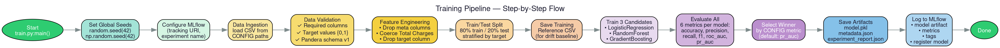

# `churn_system.training` — Model Training Pipeline

> **Location**: `src/churn_system/training/`
> **Files**: `train.py`, `feature_types.py`, `steps/data_ingestion.py`,
> `steps/data_validation.py`, `steps/feature_engineering.py`,
> `steps/model_training.py`, `steps/model_evaluation.py`

---

## Overview

The `training` package implements the complete offline model training pipeline.
It follows a step-based architecture where each stage (ingestion, validation,
feature engineering, training, evaluation) is a separate module. The orchestrating
`train.py` calls them in sequence and produces versioned model artifacts.

---

## File: `train.py`

**Purpose**: The main entry point for the training pipeline. Orchestrates all steps
and saves final artifacts.

### Function: `main()`

This is the top-level function that executes the full pipeline:

1. **Set global seeds** (`random.seed(42)`, `np.random.seed(42)`) for
   reproducibility.
2. **Configure MLflow** — sets tracking URI and experiment name.
3. **Data ingestion** — load raw CSV.
4. **Data validation** — run schema checks via Pandera.
5. **Feature engineering** — drop metadata columns, coerce types.
6. **Train/test split** — 80/20 stratified split.
7. **Save training reference** — write the training features to CSV for later
   drift detection.
8. **Train candidate models** — fit all registered classifiers.
9. **Evaluate candidates** — compute metrics and select the winner.
10. **Save artifacts** — write `model.pkl`, `metadata.json`, and
    `experiment_report.json` to `models/experiments/churn_model_YYYYMMDD_HHMMSS/`.
11. **Log to MLflow** — log model, metrics, tags, and register model.

### Constants

| Name | Value | Purpose |
|------|-------|---------|
| `GLOBAL_SEED` | `42` | Ensures reproducible training runs |
| `MODEL_VERSION` | `datetime.now()` formatted | Unique version identifier per training run |

### Helper Functions

- **`log_target_distribution(y)`**: Logs the class balance (how many 0s vs 1s).
- **`summarize_feature(name, train_series, test_series)`**: Logs mean/std
  statistics for a feature across train and test sets.

---

## File: `feature_types.py`

**Purpose**: Infers per-column Python types from a DataFrame. Used to generate
typed Pydantic fields for the API request model and to record feature types in
model metadata.

### Function: `infer_feature_types(df) → dict[str, str]`

- Iterates over DataFrame columns.
- Maps each column's pandas dtype to one of: `"int"`, `"float"`, `"str"`, `"bool"`.
- Object-typed columns default to `"str"`.
- **Used by**: `schema_generator.py` (to create typed API fields) and `train.py`
  (to record feature types in `metadata.json`).

---

## File: `steps/data_ingestion.py`

**Purpose**: Loads the raw training dataset from the configured file path.

### Function: `load_training_data() → tuple[DataFrame, Path]`

- Reads the CSV path from `CONFIG["paths"]["raw_data"]`.
- Raises `FileNotFoundError` if the file is missing.
- Returns the loaded DataFrame and the source path (used later in metadata).
- **Used by**: `train.py` as the first step of the pipeline.

---

## File: `steps/data_validation.py`

**Purpose**: Validates the training dataset before feature engineering to catch
data quality issues early.

### Function: `run_data_validation(df) → DataFrame`

1. **Cleans known raw-data quirks**:
   - Coerces `"Total Charges"` from string (with spaces) to numeric.
   - Fills missing `"Churn Reason"` values with `"Unknown"`.
2. **Runs `validate_training_data()`** from `schema.py` — checks that all 33
   required columns are present and the target column contains only `{0, 1}`.
3. **Runs Pandera schema validation** — loads `validation/schemas/v1.yaml` and
   enforces type and value constraints (e.g., `Gender` must be in
   `{Male, Female}`).
4. Returns the validated (and coerced) DataFrame.
- **Used by**: `train.py` as the second step of the pipeline.

---

## File: `steps/feature_engineering.py`

**Purpose**: Transforms validated raw data into model-ready features.

### Function: `run_feature_engineering(df) → DataFrame`

- Delegates to `build_features(df, training=True)` from the shared
  `features/build_features.py` module.
- Logs the final feature count.
- **Used by**: `train.py` as the third step of the pipeline.

---

## File: `steps/model_training.py`

**Purpose**: Defines the candidate model registry and trains all candidates.

### Function: `build_preprocessor(X) → ColumnTransformer`

- Splits columns into categorical and numerical sets.
- Applies `StandardScaler` to numeric columns and `OneHotEncoder` to
  categorical columns.
- Uses `handle_unknown="ignore"` on OneHotEncoder so new categories at
  inference time don't crash the pipeline.

### Function: `get_model_registry() → dict[str, estimator]`

Returns a dictionary of three candidate classifiers:

| Name | Algorithm | Key Hyperparameters |
|------|-----------|---------------------|
| `logistic_regression` | `LogisticRegression` | `max_iter=1000`, `class_weight="balanced"`, `random_state=42` |
| `random_forest` | `RandomForestClassifier` | `n_estimators=150`, `max_depth=8`, `random_state=42` |
| `gradient_boosting` | `GradientBoostingClassifier` | `n_estimators=120`, `learning_rate=0.08`, `random_state=42` |

All classifiers use `random_state=42` for deterministic results.

### Function: `train_candidate_models(X_train, y_train) → dict[str, Pipeline]`

- Iterates over the model registry.
- For each candidate, creates a fresh `Pipeline([preprocessor, model])` and
  fits it.
- Returns a dictionary of `{name: fitted_pipeline}`.
- **Used by**: `train.py` as the fourth step of the pipeline.

---

## File: `steps/model_evaluation.py`

**Purpose**: Evaluates all trained candidate models and selects the winner.

### Constant: `SELECTION_METRIC`

Read from `CONFIG["training"]["selection_metric"]` (default: `"roc_auc"`). This
determines which metric is used to select the winning model.

### Function: `evaluate_candidates(models, X_test, y_test)`

**Returns**: `(best_model, experiment_report, best_metrics)`

For each candidate model, computes 6 metrics:

| Metric | Function |
|--------|----------|
| `accuracy` | `accuracy_score()` |
| `precision` | `precision_score(zero_division=0)` |
| `recall` | `recall_score(zero_division=0)` |
| `f1_score` | `f1_score(zero_division=0)` |
| `roc_auc` | `roc_auc_score()` |
| `pr_auc` | `average_precision_score()` |

The model with the highest `SELECTION_METRIC` score wins. The `experiment_report`
dict records all candidates' metrics and the winner's name.

- **Used by**: `train.py` as the fifth step of the pipeline.
