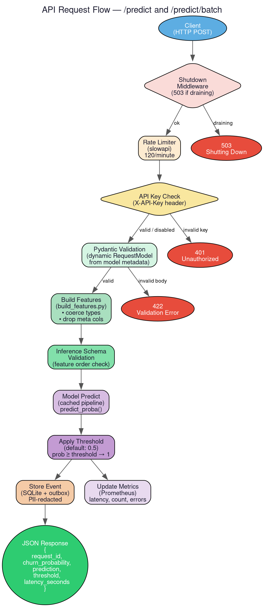

The Prediction API is the public-facing HTTP interface of the Churn ML System. It accepts customer feature data, runs it through the production model, and returns churn probability predictions. The API is built on FastAPI and exposes endpoints for single and batch prediction, health checks, and Prometheus metrics.

# Endpoints

| Route | Method | Description |
|-------|--------|-------------|
| `/` | GET | Basic health check — returns `{"status": "ok"}` |
| `/health` | GET | Readiness/liveness probe for container orchestrators (Kubernetes, ECS) |
| `/metrics` | GET | Prometheus metrics in text exposition format (see [monitoring](monitoring.md)) |
| `/predict` | POST | Single-row churn prediction |
| `/predict/batch` | POST | Batch prediction (up to `CHURN_MAX_BATCH_SIZE` rows, default 100) |
| `/explain` | POST | Per-feature SHAP explanations for a single prediction (see [explainability](explainability.md)) |
| `/explain/global` | GET | Global feature importance rankings |

# Authentication

The API uses API-key authentication via the `X-API-Key` header, checked against the `CHURN_API_KEY` environment variable (see [config](config.md)). If `CHURN_API_KEY` is not set, authentication is disabled entirely, which is useful for local development. Missing or mismatched keys return HTTP 401.

# Rate Limiting

Requests are throttled using SlowAPI. The rate limit string is configurable via `CHURN_API_RATE_LIMIT` (default: `120/minute`).

# Request Schema

The API request model is generated dynamically at import time. The `schema_generator` module reads the production model's `metadata.json` (via the [inference](inference.md) model contract) and uses `pydantic.create_model()` to build a typed request model. Each feature becomes a required, typed field. The model is configured with `extra="forbid"` — unrecognized fields are rejected.

This means the API request schema updates automatically when the model is retrained and features change, without code changes.

# Prediction Flow

1. Pydantic validation of the incoming request body.
2. [Feature building](features.md) via the shared `build_features()` function.
3. [Inference data validation](validation.md) to enforce the model's feature contract.
4. `model.predict_proba()` on the production model (loaded via `@lru_cache`).
5. Threshold comparison to produce a binary prediction.
6. [Event storage](events.md) — the prediction is durably persisted with PII redaction.
7. JSON response returned to the client.

Batch prediction follows the same flow but constructs a single DataFrame from all rows and runs `predict_proba()` once, avoiding per-row overhead.

# Graceful Shutdown

The API registers a `SIGTERM` handler that sets a shutdown flag. A middleware intercepts incoming requests and returns HTTP 503 for all routes except `/health` and `/metrics` during the drain period. This allows container orchestrators to know when the server has fully stopped.

# Error Responses

All errors use a consistent JSON shape defined by the `ErrorBody` Pydantic model:

| Field | Type | Description |
|-------|------|-------------|
| `error_code` | `str` | Machine-readable identifier (e.g. `"unauthorized"`, `"invalid_input"`, `"inference_error"`) |
| `message` | `str` | Human-readable summary |
| `detail` | `str \| None` | Additional context (e.g. validation error details) |

# Observability

The API updates [Prometheus metrics](monitoring.md) after every request: `churn_api_requests_total` (counter), `churn_api_request_latency_seconds` (histogram), and `churn_inference_errors_total` (counter on prediction failures).
