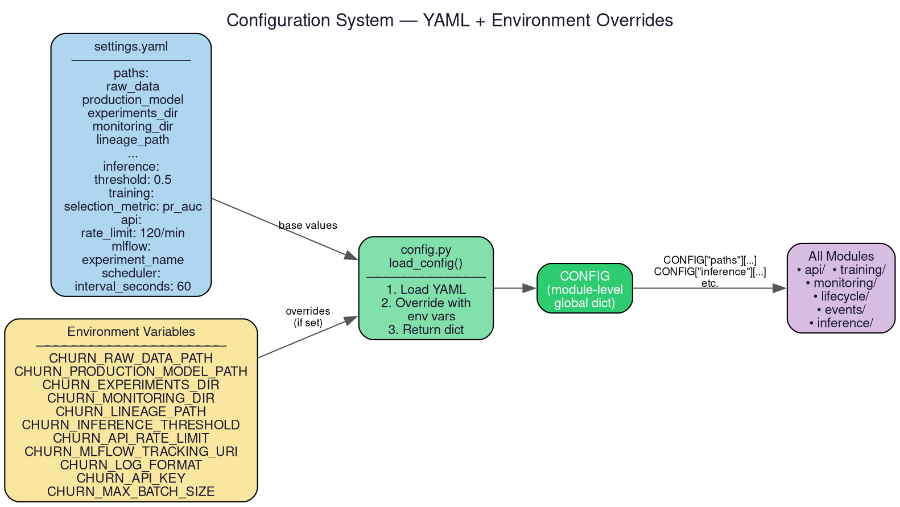

The configuration system is the single source of truth for all tunable parameters. It implements a two-layer strategy: base values in `settings.yaml` (version-controlled) with environment variable overrides for containers, CI, and cloud deployments.

Every module imports `CONFIG` from this package rather than hardcoding paths, thresholds, or URIs.

# Configuration Sections

| Section | Keys | Description |
|---------|------|-------------|
| `paths` | `raw_data`, `retraining_data`, `training_reference`, `production_model`, `experiments_dir`, `monitoring_dir`, `lineage_path`, `prediction_log_csv` | File system paths for all data and model artifacts |
| `inference` | `threshold` | Probability cutoff for binary classification (default: `0.5`) |
| `training` | `min_rows`, `min_class_count`, `selection_metric` | Training guardrails and winner selection metric (default: `pr_auc`) |
| `model_promotion` | `metric`, `min_improvement` | Metric and minimum improvement for champion-vs-challenger comparison (see [lifecycle](lifecycle.md)) |
| `api` | `rate_limit` | SlowAPI rate limit string (default: `120/minute`) for the [Prediction API](api.md) |
| `event_store` | `database_url` | SQLAlchemy connection string for the [event store](events.md) (default: SQLite) |
| `mlflow` | `tracking_uri`, `experiment_name`, `registered_model_name` | MLflow experiment configuration (see [infrastructure](infrastructure.md)) |
| `logging` | `training`, `api`, `monitoring`, `lifecycle` | Per-subsystem log file names |
| `scheduler` | `interval_seconds` | How often the [lifecycle orchestrator](lifecycle.md) runs (default: `60`) |

# Loading Mechanism

`load_config()` executes these steps:

1. Parses `settings.yaml` using `yaml.safe_load()`.
2. Iterates over `PATH_ENV_OVERRIDES` — a mapping of config keys to environment variable names. If the env var is set, it overwrites the YAML value.
3. Applies typed overrides for non-path settings using helper functions (`_set_float_if_env()`, `_set_int_if_env()`, `_set_if_env()`).
4. Returns the final merged dictionary.

`CONFIG = load_config()` is evaluated once at import time.

# Environment Variable Reference

| Variable | Config Path | Type |
|----------|-------------|------|
| `CHURN_RAW_DATA_PATH` | `paths.raw_data` | path |
| `CHURN_RETRAINING_DATA_PATH` | `paths.retraining_data` | path |
| `CHURN_TRAINING_REFERENCE_PATH` | `paths.training_reference` | path |
| `CHURN_PRODUCTION_MODEL_PATH` | `paths.production_model` | path |
| `CHURN_EXPERIMENTS_DIR` | `paths.experiments_dir` | path |
| `CHURN_MONITORING_DIR` | `paths.monitoring_dir` | path |
| `CHURN_LINEAGE_PATH` | `paths.lineage_path` | path |
| `CHURN_PREDICTION_LOG_CSV` | `paths.prediction_log_csv` | path |
| `CHURN_INFERENCE_THRESHOLD` | `inference.threshold` | float |
| `CHURN_API_RATE_LIMIT` | `api.rate_limit` | string |
| `CHURN_EVENT_STORE_DATABASE_URL` | `event_store.database_url` | string |
| `CHURN_MLFLOW_TRACKING_URI` | `mlflow.tracking_uri` | string |
| `CHURN_SCHEDULER_INTERVAL_SECONDS` | `scheduler.interval_seconds` | int |
| `CHURN_TRAINING_SELECTION_METRIC` | `training.selection_metric` | string |
| `CHURN_MODEL_PROMOTION_METRIC` | `model_promotion.metric` | string |
| `CHURN_MODEL_PROMOTION_MIN_IMPROVEMENT` | `model_promotion.min_improvement` | float |
| `CHURN_API_KEY` | *(checked in API)* | string |
| `CHURN_LOG_FORMAT` | *(checked in logger)* | string |
| `CHURN_MAX_BATCH_SIZE` | *(checked in API)* | int |
