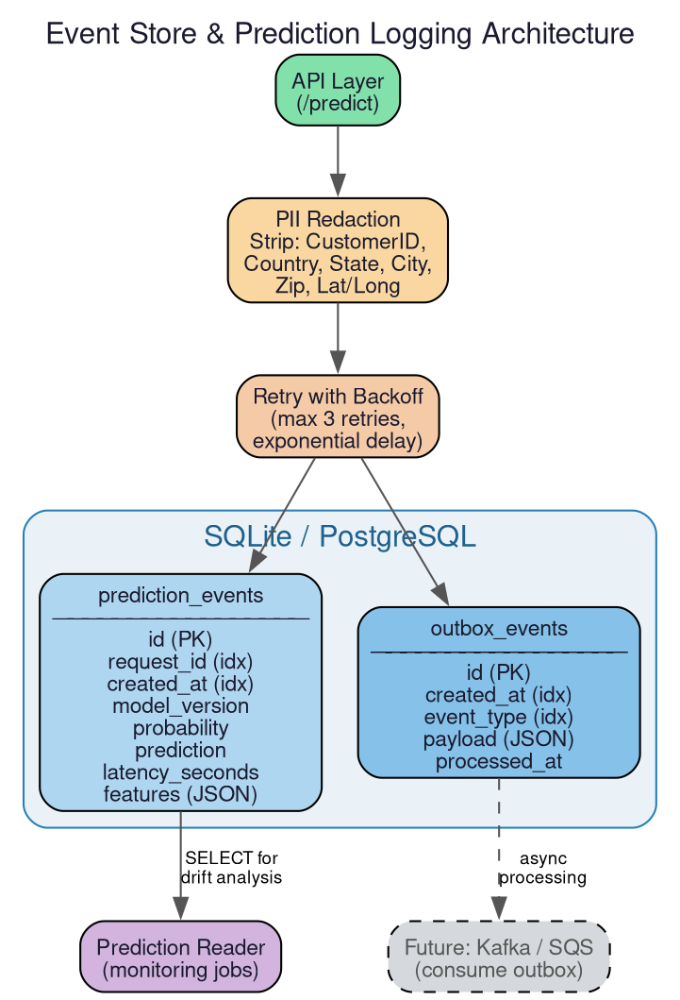

The event store implements durable, structured prediction logging using SQLAlchemy and SQLite (swappable to PostgreSQL via [configuration](config.md)). Every prediction made by the [API](api.md) is stored as a database row with PII redacted, alongside an outbox event for future async processing by the [outbox worker](workers.md).

This replaces naive CSV-append logging, providing ACID guarantees, indexed queries, and a foundation for event-driven architectures.

# Database Configuration

The database URL is read from `CONFIG["event_store"]["database_url"]` (default: `sqlite:///./data/churn_events.db`). It can be overridden with `CHURN_EVENT_STORE_DATABASE_URL` to point to PostgreSQL or any SQLAlchemy-compatible database.

The engine is created once at import time. Sessions use `autocommit=False`, `autoflush=False` — transactions must be explicitly committed.

# Data Models

## PredictionEvent

| Column | Type | Description |
|--------|------|-------------|
| `id` | Integer (PK) | Auto-incrementing primary key |
| `request_id` | String(64), indexed | UUID linking to the API request |
| `created_at` | DateTime(tz), indexed | UTC timestamp of the prediction |
| `model_version` | String(64), nullable | Which model version served this request |
| `probability` | Float | Predicted churn probability |
| `prediction` | Integer | Binary prediction (0 or 1) |
| `latency_seconds` | Float | End-to-end inference latency |
| `features` | JSON | Redacted feature values (no PII) |

## OutboxEvent

| Column | Type | Description |
|--------|------|-------------|
| `id` | Integer (PK) | Auto-incrementing primary key |
| `created_at` | DateTime(tz), indexed | When the event was created |
| `event_type` | String(64), indexed | Event category (e.g. `"prediction_made"`) |
| `payload` | JSON | Event data (request_id, model_version, probability, prediction) |
| `processed_at` | DateTime(tz), nullable | Set when an async consumer processes the event |

# PII Redaction

Sensitive fields are stripped before storage:

`CustomerID`, `Country`, `State`, `City`, `Zip Code`, `Lat Long`, `Latitude`, `Longitude`

# Write Flow

`store_prediction_event()` performs these steps:

1. Calls `init_db()` to ensure tables exist (idempotent).
2. Loads the current model version from the [model contract](inference.md).
3. Redacts sensitive fields from the raw features.
4. Inserts both a `PredictionEvent` and an `OutboxEvent` in the same database transaction.
5. Commits the transaction.

The entire write is wrapped in [retry with backoff](infrastructure.md) (max 3 retries, 0.3s base delay) retrying on `OperationalError` (DB lock contention) and `OSError` (filesystem errors).

# Consumers

- The [monitoring](monitoring.md) system reads prediction events for drift detection and statistical analysis.
- The [outbox worker](workers.md) polls unprocessed outbox events for async delivery.
