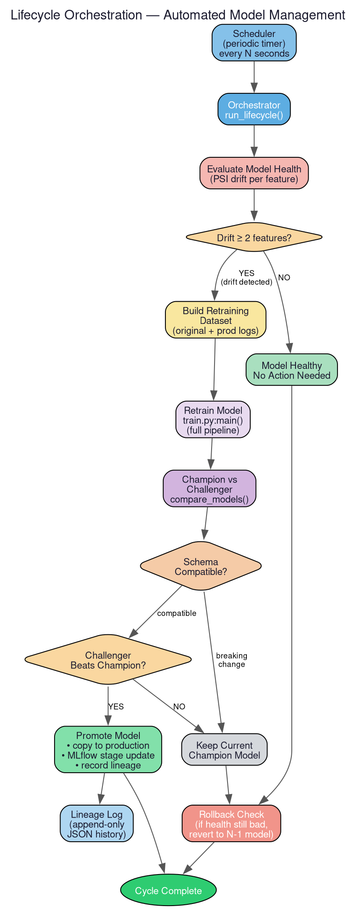

The lifecycle system manages the complete model lifecycle — from deciding whether to retrain, to comparing challenger models against the champion, to promoting winners, to rolling back if things go wrong. It implements the closed-loop automation that makes the system self-managing.

# Orchestrator

The central decision engine (`run_lifecycle()`) executes this workflow:

1. **Evaluate model health** — calls into the [monitoring](monitoring.md) system to compute PSI drift scores.
2. **Check health report** — reads `health_report.json`. If `retraining_recommended` is `True`:
   - Builds a retraining dataset (original data + production prediction logs).
   - Runs the full [training pipeline](training.md).
   - Compares the challenger against the current champion.
   - If the challenger wins and schemas are compatible: **promotes** it.
   - If the challenger loses: keeps the current champion.
3. **Run rollback check** — safety net in case the current model is unhealthy even after a promotion attempt.

The orchestrator can be run directly via `python -m churn_system.lifecycle.orchestrator` or periodically via the scheduler.

# Model Comparison

`compare_models()` decides whether a newly trained challenger should replace the current champion:

1. Finds the latest experiment directory (sorted chronologically by timestamp naming).
2. If no production model exists, auto-promotes the first model.
3. **Schema compatibility check** — calls `compare_feature_schemas()`. If the challenger has removed features (a breaking change), promotion is blocked.
4. **Metric comparison** — compares `roc_auc` between champion and challenger. Returns `True` only if the challenger's score is strictly higher.

## Schema Comparison

Computes the diff between two models' feature schemas:
- `added_features` = features in challenger but not in production
- `removed_features` = features in production but not in challenger
- `is_identical` = both sets are empty

Removed features are treated as breaking changes that block promotion.

# Promotion

`promote_model(version)` safely copies a trained model to the production serving directory:

1. Locates the experiment directory.
2. Validates that `metadata.json` exists.
3. **Schema safety check** — if a production model exists, compares schemas. Mismatches block promotion.
4. Removes the old production directory and copies the experiment to `production_dir/current/`.
5. **MLflow registry update** — if the model has an `mlflow_model_uri`, transitions its Model Registry stage to "Production" and archives previous versions.
6. **Records lineage** — appends a record to the lineage log.

After promotion, the [serving layer](serving.md) reloads the model and the [inference](inference.md) contract cache is cleared.

# Rollback

`rollback_if_needed()` automatically reverts to the previous model version if the current model is flagged as unhealthy:

1. Checks if `health_report.json` exists and shows `retraining_recommended: True`.
2. Reads the lineage log. If fewer than 2 entries exist, there's nothing to rollback to.
3. Copies the second-to-last model version from experiments to the production slot.

# Lineage

An append-only JSON log tracks all model promotions:

| Field | Description |
|-------|-------------|
| `model_version` | Timestamp-based version identifier |
| `timestamp` | UTC ISO timestamp of promotion |
| `dataset` | Path to training data used |
| `trigger` | Why retraining happened (e.g. `"drift_retraining"`) |
| `parents_model` | Version of the model this one replaced |
| `metrics` | Evaluation metrics at promotion time |

# Scheduler

`start_scheduler()` runs the orchestrator on a periodic timer ([configurable](config.md) interval, default 60 seconds). It catches exceptions non-fatally and continues the loop. Run with `python -m churn_system.lifecycle.scheduler`.
