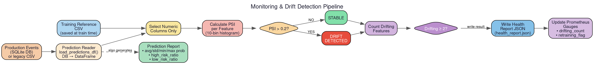

The monitoring and observability system detects when the production model's performance may be degrading and provides Prometheus metrics for real-time operational visibility. It feeds into the [lifecycle orchestrator](lifecycle.md) to trigger automated retraining.

# Drift Detection (PSI)

Population Stability Index (PSI) measures how much a feature's distribution has shifted between the training reference data and live production predictions.

PSI works by:
1. Binning the expected (training) distribution into histogram buckets.
2. Binning the actual (production) distribution using the same bucket edges.
3. Computing: `Σ (actual% - expected%) × ln(actual% / expected%)`

| PSI Value | Interpretation |
|-----------|----------------|
| < 0.1 | No significant change |
| 0.1 – 0.2 | Moderate shift — monitor closely |
| > 0.2 | Significant drift — action needed |

`calculate_psi(expected, actual, bins=10)` computes PSI between two pandas Series with smoothing (`max(val, 1e-6)`) to avoid `log(0)`.

# Model Health Evaluation

`evaluate_model_health()` determines whether retraining is recommended:

1. Loads training reference and production prediction data from the [event store](events.md).
2. Computes PSI for each numeric feature.
3. Collects features exceeding the PSI threshold (`0.2`).
4. If ≥ 2 features are drifting (`DRIFT_FEATURE_LIMIT`), sets `retraining_recommended: true`.
5. Writes a JSON health report to `monitoring_dir/health_report.json`.

This health report is consumed by the [lifecycle orchestrator](lifecycle.md).

# Prediction Statistics

`generate_prediction_report()` computes distribution stats across all stored predictions:

| Metric | Description |
|--------|-------------|
| `total_predictions` | Total number of predictions served |
| `avg_probability` | Mean predicted churn probability |
| `std_probability` | Standard deviation of probabilities |
| `min_probability` / `max_probability` | Range |
| `high_risk_ratio` | Fraction with probability > 0.7 |
| `low_risk_ratio` | Fraction with probability < 0.3 |

# Prediction Data Access

`load_predictions_df(limit=None)` reads prediction events from the database, flattens the JSON `features` column into individual DataFrame columns, and returns a time-series-ordered DataFrame for analysis. This is the shared data source for drift detection and prediction monitoring.

# Prometheus Metrics

All Prometheus metric instruments are defined centrally and exported via the [API](api.md)'s `/metrics` endpoint:

| Metric Name | Type | Labels | Description |
|-------------|------|--------|-------------|
| `churn_api_requests_total` | Counter | `path`, `method`, `status` | Total API requests |
| `churn_api_request_latency_seconds` | Histogram | `path`, `method` | Latency distribution (buckets: 5ms to 5s) |
| `churn_inference_errors_total` | Counter | — | Model inference errors |
| `churn_drifting_feature_count` | Gauge | — | Features currently flagged as drifting |
| `churn_retraining_recommended` | Gauge | — | Binary flag: 1 if retraining recommended |

## Histogram Buckets

Latency buckets (seconds): `0.005, 0.01, 0.025, 0.05, 0.1, 0.25, 0.5, 1, 2, 5`

## Alert Rules

Prometheus alerts (configured in `observability/prometheus/alert_rules.yml`):

| Alert | Condition | Severity |
|-------|-----------|----------|
| High error rate | Error rate > 2% over 5 minutes | Critical |
| Slow responses | p95 latency > 500ms over 5 minutes | Warning |
| Feature drift | ≥ 2 drifting features | Warning |

## Where Metrics Are Updated

| Metric | Updated In |
|--------|------------|
| `REQUESTS_TOTAL`, `REQUEST_LATENCY_SECONDS` | [API](api.md) — after every request |
| `INFERENCE_ERRORS_TOTAL` | [API](api.md) — on prediction failures |
| `DRIFTING_FEATURES`, `RETRAINING_RECOMMENDED` | Model health evaluation (this module) |
