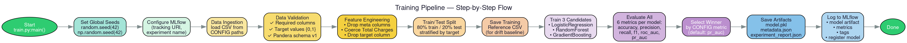

The training pipeline trains churn prediction models offline. It follows a step-based architecture where each stage — ingestion, validation, feature engineering, training, and evaluation — is a separate module. The orchestrating entry point calls them in sequence and produces versioned model artifacts.

# Pipeline Steps

1. **Set global seeds** — `random.seed(42)`, `np.random.seed(42)` for reproducibility.
2. **Configure MLflow** — sets tracking URI and experiment name (see [infrastructure](infrastructure.md)).
3. **Data ingestion** — loads raw CSV from [configured](config.md) path.
4. **Data validation** — runs schema checks via [Pandera validation](validation.md).
5. **Feature engineering** — delegates to the shared [feature builder](features.md).
6. **Train/test split** — 80/20 stratified split.
7. **Save training reference** — writes training features to CSV for later [drift detection](monitoring.md).
8. **Train candidate models** — fits all registered classifiers.
9. **Evaluate candidates** — computes metrics and selects the winner.
10. **Save artifacts** — writes `model.pkl`, `metadata.json`, and `experiment_report.json` to `models/experiments/churn_model_YYYYMMDD_HHMMSS/`.
11. **Log to MLflow** — logs model, metrics, tags, and registers the model.

# Candidate Models

The model registry defines three candidate classifiers, all using `random_state=42`:

| Name | Algorithm | Key Hyperparameters |
|------|-----------|---------------------|
| `logistic_regression` | LogisticRegression | `max_iter=1000`, `class_weight="balanced"` |
| `random_forest` | RandomForestClassifier | `n_estimators=150`, `max_depth=8` |
| `gradient_boosting` | GradientBoostingClassifier | `n_estimators=120`, `learning_rate=0.08` |

# Preprocessing

The preprocessor is a scikit-learn `ColumnTransformer` that applies `StandardScaler` to numeric columns and `OneHotEncoder` (with `handle_unknown="ignore"`) to categorical columns. Each candidate is wrapped in a `Pipeline([preprocessor, model])`.

# Evaluation Metrics

For each candidate, six metrics are computed:

| Metric | Function |
|--------|----------|
| `accuracy` | `accuracy_score()` |
| `precision` | `precision_score(zero_division=0)` |
| `recall` | `recall_score(zero_division=0)` |
| `f1_score` | `f1_score(zero_division=0)` |
| `roc_auc` | `roc_auc_score()` |
| `pr_auc` | `average_precision_score()` |

The winning model is selected by the highest score on the configurable `SELECTION_METRIC` (default: `roc_auc`, see [config](config.md)).

# Feature Type Inference

The `feature_types` module infers per-column Python types (`int`, `float`, `str`, `bool`) from the training DataFrame. These types are recorded in `metadata.json` and used by the [API](api.md) to dynamically generate typed Pydantic request fields.

# Artifacts Produced

Each training run writes to `models/experiments/churn_model_<timestamp>/`:

- `model.pkl` — serialized scikit-learn pipeline
- `metadata.json` — feature schema, feature count, metrics, feature types, data source path
- `experiment_report.json` — all candidates' metrics and the winner's name

These artifacts are consumed by the [lifecycle](lifecycle.md) system for champion-vs-challenger comparison and promotion.
